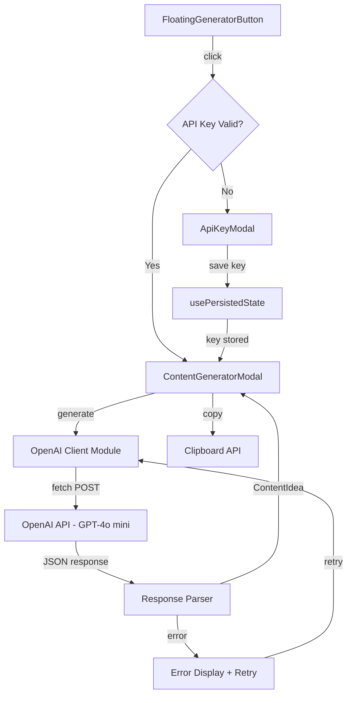

# Design Document: AI Content Generator

## Overview

The AI Content Generator integrates OpenAI's GPT-4o mini model into the Xawars RNG app to help Rainbow Six Siege content creators generate ideas for YouTube, TikTok, and Instagram. The feature provides a floating action button that opens a modal-based workflow: first collecting an API key (if not already stored), then generating structured content ideas including titles, story hooks, mission directives, and thumbnail prompts.

### Key Design Decisions

1. **Client-side API calls**: The OpenAI API is called directly from the browser using the user's own API key. This avoids the need for a backend proxy, keeps the architecture simple, and means zero server-side cost. The tradeoff is that the API key is stored in localStorage (acceptable for a personal tool).

2. **GPT-4o mini model**: Chosen for its excellent cost-to-quality ratio (~$0.00015 per generation). It handles structured JSON output well and is fast enough for interactive use.

3. **No `openai` SDK dependency**: To keep the bundle lean and avoid Node.js-specific code in the browser, the implementation uses the native `fetch` API to call the OpenAI Chat Completions endpoint directly. This avoids compatibility issues with Next.js App Router and keeps the dependency footprint minimal.

4. **Modal-based UX**: Follows the existing app pattern (DeploymentModal, OperatorCardModal, ThumbnailEditorModal) with consistent styling, backdrop blur, and keyboard accessibility.

5. **usePersistedState for API key**: Reuses the existing hook for localStorage persistence, consistent with how other app state (kills, deaths, history) is stored.

## Architecture



### Component Hierarchy

```
page.tsx
├── FloatingGeneratorButton
├── ApiKeyModal (conditional)
└── ContentGeneratorModal (conditional)
    ├── Header (title + generate button + close)
    ├── LoadingState (spinner + text)
    ├── ErrorState (message + retry button)
    └── ContentDisplay
        ├── ContentIdeaSection + CopyButton
        ├── TitleVariationsSection + CopyAllButton
        ├── StoryHookSection + CopyButton
        ├── MissionDirectiveSection + CopyButton
        └── ThumbnailPromptsSection + CopyAllButton
```

### Data Flow

1. User clicks FloatingGeneratorButton
2. App checks if a valid API key exists in localStorage (`xawars_openai_api_key`)
3. If no valid key → open ApiKeyModal → validate → persist → proceed
4. If valid key → open ContentGeneratorModal → trigger generation
5. OpenAI client sends POST to `https://api.openai.com/v1/chat/completions`
6. Response is parsed into a `ContentIdea` object
7. Content is displayed in labeled sections with copy buttons
8. Errors are caught, classified, and displayed with retry options

## Components and Interfaces

### FloatingGeneratorButton

```typescript
interface FloatingGeneratorButtonProps {
  onClick: () => void;
}
```

A fixed-position button (bottom-right, z-40) with Sparkles icon and "Generate" text. Uses yellow-500 background, pill shape, shadow-lg. Hover scales to 105%, active scales to 95%. Accessible via keyboard with aria-label.

### ApiKeyModal

```typescript
interface ApiKeyModalProps {
  isOpen: boolean;
  onClose: () => void;
  onSave: (key: string) => void;
  error?: string | null;
}
```

Modal with password input, validation (must start with "sk-", min 20 chars), link to OpenAI platform, security notice, and Cancel/Save buttons. Uses zinc-900 background, zinc-700/50 borders, rounded-xl — matching existing modal patterns.

### ContentGeneratorModal

```typescript
interface ContentGeneratorModalProps {
  isOpen: boolean;
  onClose: () => void;
  idea: ContentIdea | null;
  isGenerating: boolean;
  error: string | null;
  onGenerate: () => void;
  onClearApiKey: () => void;
}
```

Main display modal with scrollable content (max-h-[90vh]), header with generate/close buttons, and five content sections. Responsive: max-w-md on desktop, full-width with padding on mobile.

### CopyButton

```typescript
interface CopyButtonProps {
  text: string;
  label?: string;
  className?: string;
}
```

Reusable component that copies text to clipboard. Shows clipboard icon + "Copy" by default, switches to green checkmark + "Copied!" for 2 seconds on success. Fails silently (stays in default state) if clipboard write fails.

### OpenAI Client Module (`app/lib/openai.ts`)

```typescript
// Core generation function
export async function generateContentIdea(apiKey: string): Promise<ContentIdea>;

// API key validation (pure function)
export function validateApiKey(key: string): { valid: boolean; error?: string };

// Error classification
export function classifyApiError(error: unknown): ApiError;
```

The module is stateless — the API key is passed as a parameter rather than stored in module-level state. This avoids stale closures and makes testing straightforward.

## Data Models

### ContentIdea

```typescript
export interface ContentIdea {
  contentIdea: string;
  titleVariations: [string, string, string]; // exactly 3
  storyHook: string;
  missionDirective: string;
  thumbnailPrompts: [string, string, string]; // exactly 3
}
```

### ApiError

```typescript
export type ApiErrorType = 
  | 'network'
  | 'auth'
  | 'rate_limit'
  | 'timeout'
  | 'parse_error'
  | 'empty_response'
  | 'unknown';

export interface ApiError {
  type: ApiErrorType;
  message: string;
  retryable: boolean;
}
```

### API Key Validation Result

```typescript
export interface ApiKeyValidationResult {
  valid: boolean;
  error?: string;
}
```

### OpenAI Request Configuration

```typescript
const OPENAI_CONFIG = {
  model: 'gpt-4o-mini',
  maxTokens: 1000,
  temperature: 0.9,
  timeoutMs: 30000,
  endpoint: 'https://api.openai.com/v1/chat/completions',
} as const;
```

### State Shape (in page.tsx)

```typescript
// Persisted
const [apiKey, setApiKey] = usePersistedState<string>('xawars_openai_api_key', '');

// Transient
const [isApiKeyModalOpen, setIsApiKeyModalOpen] = useState(false);
const [isGeneratorOpen, setIsGeneratorOpen] = useState(false);
const [isGenerating, setIsGenerating] = useState(false);
const [currentIdea, setCurrentIdea] = useState<ContentIdea | null>(null);
const [generatorError, setGeneratorError] = useState<string | null>(null);
```

## Correctness Properties

*A property is a characteristic or behavior that should hold true across all valid executions of a system — essentially, a formal statement about what the system should do. Properties serve as the bridge between human-readable specifications and machine-verifiable correctness guarantees.*

### Property 1: API key validation is correct and complete

*For any* string `s`, `validateApiKey(s)` returns `{ valid: true }` if and only if `s` starts with `"sk-"` and `s.length >= 20`. Otherwise it returns `{ valid: false, error }` where the error is `"Invalid API key format. Must start with sk-"` when the prefix is wrong, or `"API key too short"` when the prefix is correct but length is insufficient.

**Validates: Requirements 1.4, 1.5, 2.2, 2.3, 2.4**

### Property 2: API key persistence round-trip

*For any* valid API key string (starts with "sk-", length >= 20), persisting it via `usePersistedState` with key `"xawars_openai_api_key"` and then reading it back from localStorage yields the identical string.

**Validates: Requirements 2.5, 8.4**

### Property 3: Valid ContentIdea JSON parsing preserves all fields

*For any* valid JSON object containing a `contentIdea` string, a `titleVariations` array of exactly 3 strings, a `storyHook` string, a `missionDirective` string, and a `thumbnailPrompts` array of exactly 3 strings, parsing it with the response parser produces a `ContentIdea` object where every field value equals the original input.

**Validates: Requirements 3.3**

### Property 4: Invalid or incomplete JSON is rejected

*For any* JSON string that is either malformed (not valid JSON) or a valid JSON object missing at least one required field (`contentIdea`, `titleVariations`, `storyHook`, `missionDirective`, `thumbnailPrompts`) or where `titleVariations`/`thumbnailPrompts` does not have exactly 3 items, the response parser throws an error with the message "Failed to parse API response".

**Validates: Requirements 3.4, 3.5**

### Property 5: Title variations "Copy All" formatting

*For any* array of exactly 3 non-empty strings `[t1, t2, t3]`, the title variations copy-all formatter produces the string `"1. {t1}\n2. {t2}\n3. {t3}"`.

**Validates: Requirements 5.6**

### Property 6: Thumbnail prompts "Copy All" formatting

*For any* array of exactly 3 non-empty strings `[p1, p2, p3]`, the thumbnail prompts copy-all formatter produces the string `"• {p1}\n• {p2}\n• {p3}"`.

**Validates: Requirements 5.8**

### Property 7: Copy button preserves text exactly

*For any* non-empty string passed to the CopyButton component, when the copy action is triggered, the string written to the clipboard is identical to the input string (no trimming, no transformation).

**Validates: Requirements 5.2**

### Property 8: ContentIdea state retention across modal close/reopen

*For any* valid `ContentIdea` object stored in component state, closing the ContentGeneratorModal and reopening it (without triggering a new generation) yields the same `ContentIdea` object with all fields unchanged.

**Validates: Requirements 8.5**

## Error Handling

### Error Classification Strategy

All errors from the OpenAI API call are classified by the `classifyApiError` function into typed `ApiError` objects:

| HTTP Status / Condition | ApiErrorType | User Message | Retryable | Action |
|------------------------|--------------|--------------|-----------|--------|
| Network failure (fetch throws) | `network` | "Network error. Check your connection." | Yes | Show retry button |
| HTTP 401 | `auth` | "API key is invalid. Please re-enter." | No | Clear key, open ApiKeyModal |
| HTTP 429 | `rate_limit` | "Too many requests. Please wait." | Yes | Show retry button |
| HTTP 5xx | `unknown` | "Server error. Try again later." | Yes | Show retry button |
| Response timeout (30s) | `timeout` | "Request timed out. Try again." | Yes | Show retry button |
| Empty response body | `empty_response` | "No content generated from API" | Yes | Show retry button |
| Malformed/incomplete JSON | `parse_error` | "Failed to parse API response" | Yes | Show retry button |

### Error Flow

1. **Retryable errors** (network, rate_limit, timeout, empty_response, parse_error): Display error message in ContentGeneratorModal with "Try Again" button. API key is preserved.
2. **Auth errors** (HTTP 401): Clear the stored API key, close ContentGeneratorModal, open ApiKeyModal with error message.
3. **Retry behavior**: Clicking "Try Again" clears the error state and re-triggers `generateContentIdea()` with the same API key.

### Timeout Implementation

```typescript
const controller = new AbortController();
const timeoutId = setTimeout(() => controller.abort(), 30000);

try {
  const response = await fetch(OPENAI_CONFIG.endpoint, {
    signal: controller.signal,
    // ...
  });
} finally {
  clearTimeout(timeoutId);
}
```

### Graceful Degradation

- If clipboard API is unavailable (older browsers, non-HTTPS), CopyButton fails silently — no error shown, button stays in default state.
- If localStorage is full or unavailable, usePersistedState falls back to in-memory state (existing hook behavior).

## Testing Strategy

### Property-Based Tests (fast-check)

The project will use [fast-check](https://github.com/dubzzz/fast-check) for property-based testing with Vitest as the test runner.

**Configuration:**
- Minimum 100 iterations per property test
- Each test tagged with: `Feature: ai-content-generator, Property {N}: {description}`

**Properties to implement:**

| Property | Module Under Test | Generator Strategy |
|----------|------------------|-------------------|
| 1: API key validation | `app/lib/openai.ts` → `validateApiKey` | `fc.string()` with bias toward "sk-" prefixed strings |
| 2: Persistence round-trip | `usePersistedState` + localStorage mock | `fc.string().filter(s => s.startsWith('sk-') && s.length >= 20)` |
| 3: Valid JSON parsing | `app/lib/openai.ts` → response parser | `fc.record({ contentIdea: fc.string(), titleVariations: fc.tuple(fc.string(), fc.string(), fc.string()), ... })` |
| 4: Invalid JSON rejection | `app/lib/openai.ts` → response parser | `fc.oneof(fc.string(), partialContentIdea())` — strings that aren't valid JSON or objects missing fields |
| 5: Title formatting | Formatting utility | `fc.tuple(fc.string({minLength:1}), fc.string({minLength:1}), fc.string({minLength:1}))` |
| 6: Thumbnail formatting | Formatting utility | Same as Property 5 |
| 7: Copy preserves text | CopyButton / clipboard mock | `fc.string({minLength:1})` |
| 8: State retention | React state (render test) | `fc.record(...)` generating valid ContentIdea objects |

### Unit Tests (Example-Based)

- **UI rendering**: Verify correct CSS classes, element presence, accessibility attributes
- **Modal interactions**: Open/close, keyboard (Escape), backdrop click
- **Loading/error states**: Spinner display, button disabled state, error messages
- **Error classification**: Specific HTTP status codes map to correct error types
- **Timeout**: AbortController fires at 30s

### Integration Tests

- **End-to-end flow**: Click button → API key modal → save key → generation → display content → copy
- **Error recovery**: Auth error → key cleared → re-enter key → successful generation
- **Retry flow**: Network error → retry → success

### Test File Structure

```
app/
├── lib/
│   ├── openai.ts
│   └── __tests__/
│       ├── openai.test.ts          (unit + property tests for validation/parsing)
│       └── openai.property.test.ts (dedicated property tests)
├── components/
│   └── __tests__/
│       ├── FloatingGeneratorButton.test.tsx
│       ├── ApiKeyModal.test.tsx
│       ├── ContentGeneratorModal.test.tsx
│       └── CopyButton.test.tsx
└── hooks/
    └── __tests__/
        └── usePersistedState.test.ts
```

