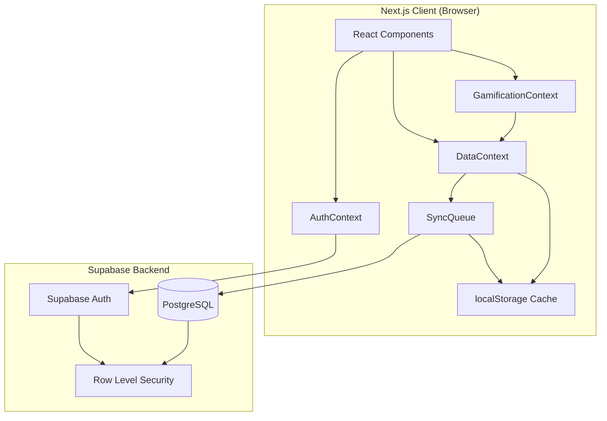

# Design Document: Auth, Persistence & Gamification

## Overview

This design introduces three interconnected systems to the XA Wars RNG app:

1. **Authentication** — Email/password registration and login, OAuth (Google/Discord), session management, and guest mode
2. **Cloud Persistence** — Migration from localStorage to a cloud database (Supabase) for all user data, with offline resilience
3. **Gamification** — XP/level system, achievements, daily streaks, and a user profile

The current app stores all state in localStorage via the `usePersistedState` hook. This design replaces that with a layered persistence architecture: a local cache for immediate reads, a sync queue for offline writes, and Supabase as the source of truth for authenticated users. Guest users continue using localStorage only.

### Key Design Decisions

- **Supabase** is chosen as the backend (auth + database + realtime) because it provides built-in email/password auth, OAuth providers, PostgreSQL database, Row Level Security (RLS), and a generous free tier. It eliminates the need for a custom backend.
- **Optimistic local-first writes** — The UI always writes to local state first, then syncs to the cloud asynchronously. This keeps the app snappy and handles offline gracefully.
- **Gamification is server-authoritative** — XP and achievement calculations happen in the client but are validated/persisted server-side to prevent trivial manipulation.

## Architecture



### Data Flow

1. **Authenticated user performs action** → Component calls DataContext method → Local state updated immediately → SyncQueue enqueues cloud write → Supabase persists when online
2. **User logs in on new device** → AuthContext establishes session → DataContext fetches all user data from Supabase → Local state hydrated
3. **Offline scenario** → SyncQueue detects no connectivity → Writes accumulate in localStorage queue → On reconnect, queue drains in order with timestamp-based conflict resolution

## Components and Interfaces

### Authentication Layer

```typescript
// lib/supabase.ts
import { createClient } from '@supabase/supabase-js';

export const supabase = createClient(
  process.env.NEXT_PUBLIC_SUPABASE_URL!,
  process.env.NEXT_PUBLIC_SUPABASE_ANON_KEY!
);
```

```typescript
// context/AuthContext.tsx
interface AuthState {
  user: User | null;
  session: Session | null;
  isLoading: boolean;
  isGuest: boolean;
}

interface AuthContextValue extends AuthState {
  signUp: (email: string, password: string) => Promise<AuthResult>;
  signIn: (email: string, password: string) => Promise<AuthResult>;
  signInWithOAuth: (provider: 'google' | 'discord') => Promise<void>;
  signOut: () => Promise<void>;
}

interface AuthResult {
  success: boolean;
  error?: string;
}

interface User {
  id: string;
  email: string;
  displayName?: string;
  avatarUrl?: string;
  createdAt: string;
}
```

### Data Persistence Layer

```typescript
// context/DataContext.tsx
interface DataContextValue {
  // Rank progression
  rankedStats: RankedStats;
  updateRankedStats: (platform: 'PC' | 'Console', stats: Partial<RankProgress>) => void;

  // Roulette history
  deploymentHistory: DeploymentRecord[];
  addDeployment: (record: DeploymentRecord) => void;

  // Operator stats
  operatorStats: Record<string, OperatorStatRecord>;
  updateOperatorStat: (operatorId: string, delta: { kills?: number; deaths?: number }) => void;

  // Content ideas
  contentIdeas: SavedContentIdea[];
  addContentIdea: (idea: ContentIdea) => void;
  deleteContentIdea: (id: string) => void;

  // Migration
  migrationStatus: 'idle' | 'pending' | 'migrating' | 'complete' | 'failed';
  startMigration: () => Promise<void>;
  dismissMigration: () => void;
}
```

### Sync Queue

```typescript
// lib/sync-queue.ts
interface QueuedOperation {
  id: string;
  table: string;
  operation: 'upsert' | 'insert' | 'delete';
  payload: Record<string, unknown>;
  timestamp: number;
  retryCount: number;
}

interface SyncQueue {
  enqueue: (op: Omit<QueuedOperation, 'id' | 'timestamp' | 'retryCount'>) => void;
  drain: () => Promise<void>;
  pending: QueuedOperation[];
  isOnline: boolean;
}
```

### Gamification Layer

```typescript
// context/GamificationContext.tsx
interface GamificationState {
  totalXP: number;
  level: number;
  xpToNextLevel: number;
  currentStreak: number;
  longestStreak: number;
  lastActiveDate: string | null;
  achievements: Achievement[];
}

interface GamificationContextValue extends GamificationState {
  awardXP: (amount: number, source: XPSource) => void;
  checkAchievements: () => void;
  recordActivity: () => void;
}

type XPSource = 'deployment' | 'kill_target' | 'content_idea' | 'ranked_win';

interface Achievement {
  id: string;
  title: string;
  description: string;
  category: 'deployment' | 'kills' | 'rank' | 'content' | 'streak';
  xpReward: number;
  condition: AchievementCondition;
  unlockedAt: string | null;
}

interface AchievementCondition {
  type: 'threshold';
  metric: string;
  value: number;
}
```

### Migration Service

```typescript
// lib/migration-service.ts
interface MigrationResult {
  success: boolean;
  migratedKeys: string[];
  errors: string[];
}

function detectLocalStorageData(): boolean;
function migrateToCloud(userId: string): Promise<MigrationResult>;
function clearMigratedKeys(keys: string[]): void;
```

## Data Models

### Supabase Database Schema

```sql
-- Users profile (extends Supabase auth.users)
CREATE TABLE public.profiles (
  id UUID PRIMARY KEY REFERENCES auth.users(id) ON DELETE CASCADE,
  display_name TEXT,
  avatar_url TEXT,
  created_at TIMESTAMPTZ DEFAULT NOW()
);

-- Ranked stats
CREATE TABLE public.ranked_stats (
  id UUID PRIMARY KEY DEFAULT gen_random_uuid(),
  user_id UUID NOT NULL REFERENCES public.profiles(id) ON DELETE CASCADE,
  platform TEXT NOT NULL CHECK (platform IN ('PC', 'Console')),
  tier TEXT NOT NULL,
  division INTEGER NOT NULL CHECK (division BETWEEN 1 AND 5),
  rp INTEGER NOT NULL DEFAULT 0,
  peak_tier TEXT NOT NULL,
  peak_division INTEGER NOT NULL CHECK (peak_division BETWEEN 1 AND 5),
  updated_at TIMESTAMPTZ DEFAULT NOW(),
  UNIQUE(user_id, platform)
);

-- Deployment history (roulette)
CREATE TABLE public.deployments (
  id UUID PRIMARY KEY DEFAULT gen_random_uuid(),
  user_id UUID NOT NULL REFERENCES public.profiles(id) ON DELETE CASCADE,
  operator_id TEXT NOT NULL,
  operator_name TEXT NOT NULL,
  operator_side TEXT NOT NULL,
  loadout JSONB NOT NULL,
  match_type TEXT,
  platform TEXT,
  target_kills INTEGER NOT NULL DEFAULT 0,
  role TEXT,
  deployed_at TIMESTAMPTZ DEFAULT NOW()
);

-- Operator stats
CREATE TABLE public.operator_stats (
  id UUID PRIMARY KEY DEFAULT gen_random_uuid(),
  user_id UUID NOT NULL REFERENCES public.profiles(id) ON DELETE CASCADE,
  operator_id TEXT NOT NULL,
  operator_name TEXT NOT NULL,
  operator_side TEXT NOT NULL,
  kills INTEGER NOT NULL DEFAULT 0,
  deaths INTEGER NOT NULL DEFAULT 0,
  deployments INTEGER NOT NULL DEFAULT 0,
  updated_at TIMESTAMPTZ DEFAULT NOW(),
  UNIQUE(user_id, operator_id)
);

-- Content ideas
CREATE TABLE public.content_ideas (
  id UUID PRIMARY KEY DEFAULT gen_random_uuid(),
  user_id UUID NOT NULL REFERENCES public.profiles(id) ON DELETE CASCADE,
  content_idea TEXT NOT NULL,
  story_hook TEXT NOT NULL,
  mission_directive TEXT NOT NULL,
  title_variations JSONB NOT NULL,
  thumbnail_prompts JSONB NOT NULL,
  saved_at TIMESTAMPTZ DEFAULT NOW()
);

-- Gamification: XP and levels
CREATE TABLE public.gamification (
  user_id UUID PRIMARY KEY REFERENCES public.profiles(id) ON DELETE CASCADE,
  total_xp INTEGER NOT NULL DEFAULT 0,
  current_streak INTEGER NOT NULL DEFAULT 0,
  longest_streak INTEGER NOT NULL DEFAULT 0,
  last_active_date DATE,
  updated_at TIMESTAMPTZ DEFAULT NOW()
);

-- Achievements
CREATE TABLE public.achievements (
  id UUID PRIMARY KEY DEFAULT gen_random_uuid(),
  user_id UUID NOT NULL REFERENCES public.profiles(id) ON DELETE CASCADE,
  achievement_id TEXT NOT NULL,
  unlocked_at TIMESTAMPTZ DEFAULT NOW(),
  UNIQUE(user_id, achievement_id)
);

-- Sync queue (for offline resilience, stored in localStorage but schema documented here)
-- This is NOT a Supabase table; it lives in localStorage as JSON
```

### Row Level Security Policies

```sql
-- All tables: users can only access their own data
ALTER TABLE public.profiles ENABLE ROW LEVEL SECURITY;
ALTER TABLE public.ranked_stats ENABLE ROW LEVEL SECURITY;
ALTER TABLE public.deployments ENABLE ROW LEVEL SECURITY;
ALTER TABLE public.operator_stats ENABLE ROW LEVEL SECURITY;
ALTER TABLE public.content_ideas ENABLE ROW LEVEL SECURITY;
ALTER TABLE public.gamification ENABLE ROW LEVEL SECURITY;
ALTER TABLE public.achievements ENABLE ROW LEVEL SECURITY;

CREATE POLICY "Users can read own profile" ON public.profiles
  FOR SELECT USING (auth.uid() = id);
CREATE POLICY "Users can update own profile" ON public.profiles
  FOR UPDATE USING (auth.uid() = id);

-- Similar policies for all other tables using user_id = auth.uid()
```

### TypeScript Data Models

```typescript
// types/database.ts
interface DeploymentRecord {
  id: string;
  operatorId: string;
  operatorName: string;
  operatorSide: 'attacker' | 'defender';
  loadout: Loadout;
  matchType?: MatchType;
  platform?: Platform;
  targetKills: number;
  role?: string;
  deployedAt: string;
}

interface OperatorStatRecord {
  operatorId: string;
  operatorName: string;
  operatorSide: 'attacker' | 'defender';
  kills: number;
  deaths: number;
  deployments: number;
}

interface GamificationRecord {
  totalXP: number;
  currentStreak: number;
  longestStreak: number;
  lastActiveDate: string | null;
}

interface AchievementRecord {
  achievementId: string;
  unlockedAt: string;
}
```

### Achievement Definitions

```typescript
// data/achievements.ts
const ACHIEVEMENT_DEFINITIONS: Achievement[] = [
  // Deployment milestones
  { id: 'deploy_10', title: 'Rookie Roller', description: 'Deploy 10 operators', category: 'deployment', xpReward: 50, condition: { type: 'threshold', metric: 'total_deployments', value: 10 }, unlockedAt: null },
  { id: 'deploy_50', title: 'Seasoned Spinner', description: 'Deploy 50 operators', category: 'deployment', xpReward: 100, condition: { type: 'threshold', metric: 'total_deployments', value: 50 }, unlockedAt: null },
  { id: 'deploy_100', title: 'Deployment Veteran', description: 'Deploy 100 operators', category: 'deployment', xpReward: 200, condition: { type: 'threshold', metric: 'total_deployments', value: 100 }, unlockedAt: null },

  // Kill milestones
  { id: 'kills_100', title: 'Century Slayer', description: 'Reach 100 total kills', category: 'kills', xpReward: 75, condition: { type: 'threshold', metric: 'total_kills', value: 100 }, unlockedAt: null },
  { id: 'kills_500', title: 'Half-K Hunter', description: 'Reach 500 total kills', category: 'kills', xpReward: 150, condition: { type: 'threshold', metric: 'total_kills', value: 500 }, unlockedAt: null },
  { id: 'kills_1000', title: 'Thousand Eliminations', description: 'Reach 1000 total kills', category: 'kills', xpReward: 300, condition: { type: 'threshold', metric: 'total_kills', value: 1000 }, unlockedAt: null },

  // Rank milestones
  { id: 'rank_gold', title: 'Gold Standard', description: 'Reach Gold rank', category: 'rank', xpReward: 100, condition: { type: 'threshold', metric: 'rank_tier', value: 3 }, unlockedAt: null },
  { id: 'rank_diamond', title: 'Diamond Hands', description: 'Reach Diamond rank', category: 'rank', xpReward: 200, condition: { type: 'threshold', metric: 'rank_tier', value: 6 }, unlockedAt: null },
  { id: 'rank_champion', title: 'Champion\'s Crown', description: 'Reach Champion rank', category: 'rank', xpReward: 500, condition: { type: 'threshold', metric: 'rank_tier', value: 7 }, unlockedAt: null },

  // Content milestones
  { id: 'content_10', title: 'Idea Machine', description: 'Generate 10 content ideas', category: 'content', xpReward: 50, condition: { type: 'threshold', metric: 'total_content_ideas', value: 10 }, unlockedAt: null },
  { id: 'content_25', title: 'Creative Flow', description: 'Generate 25 content ideas', category: 'content', xpReward: 100, condition: { type: 'threshold', metric: 'total_content_ideas', value: 25 }, unlockedAt: null },
  { id: 'content_50', title: 'Content Factory', description: 'Generate 50 content ideas', category: 'content', xpReward: 200, condition: { type: 'threshold', metric: 'total_content_ideas', value: 50 }, unlockedAt: null },

  // Streak milestones
  { id: 'streak_3', title: 'Three-Peat', description: 'Maintain a 3-day streak', category: 'streak', xpReward: 30, condition: { type: 'threshold', metric: 'current_streak', value: 3 }, unlockedAt: null },
  { id: 'streak_7', title: 'Week Warrior', description: 'Maintain a 7-day streak', category: 'streak', xpReward: 75, condition: { type: 'threshold', metric: 'current_streak', value: 7 }, unlockedAt: null },
  { id: 'streak_30', title: 'Monthly Dedication', description: 'Maintain a 30-day streak', category: 'streak', xpReward: 250, condition: { type: 'threshold', metric: 'current_streak', value: 30 }, unlockedAt: null },
];
```


## Correctness Properties

*A property is a characteristic or behavior that should hold true across all valid executions of a system — essentially, a formal statement about what the system should do. Properties serve as the bridge between human-readable specifications and machine-verifiable correctness guarantees.*

### Property 1: Password Validation Boundary

*For any* string of length less than 8, the password validator SHALL reject it; *for any* string of length 8 or greater, the password validator SHALL accept it (assuming no other constraints).

**Validates: Requirements 1.3**

### Property 2: Migration Data Transformation Round-Trip

*For any* valid localStorage state containing app data (ranked stats, operator history, kills, deaths, content ideas), transforming it to the cloud database format and back SHALL produce an equivalent data set.

**Validates: Requirements 5.1, 5.2**

### Property 3: Platform Independence for Rank Stats

*For any* rank update applied to one platform (PC or Console), the other platform's rank data (tier, division, RP, peak) SHALL remain unchanged.

**Validates: Requirements 6.4**

### Property 4: Deployment History Capacity Invariant

*For any* sequence of deployment additions, the deployment history length SHALL never exceed 100, and when a new deployment is added to a full history, the oldest deployment SHALL be removed while the newest is retained.

**Validates: Requirements 7.2, 7.3**

### Property 5: Operator Stats Independence

*For any* stat update (kills, deaths) applied to one operator, all other operators' stats SHALL remain unchanged.

**Validates: Requirements 8.2**

### Property 6: Content Idea Serialization Round-Trip

*For any* valid content idea (with title variations, story hook, mission directive, and thumbnail prompts), serializing to the database format and deserializing back SHALL produce an equivalent content idea.

**Validates: Requirements 9.1**

### Property 7: Content Idea Capacity Invariant

*For any* sequence of content idea additions, the content idea history length SHALL never exceed 50, and when a new idea is added to a full history, the oldest idea SHALL be removed while the newest is retained.

**Validates: Requirements 9.2, 9.3**

### Property 8: Level Calculation Formula

*For any* non-negative integer totalXP, the calculated level SHALL equal `floor(totalXP / 100) + 1`.

**Validates: Requirements 10.5**

### Property 9: Level-Up Boundary Detection

*For any* XP addition where the previous XP and new XP cross a 100-point boundary (i.e., `floor(prevXP / 100) < floor(newXP / 100)`), the system SHALL signal a level-up event.

**Validates: Requirements 10.6**

### Property 10: Achievement Unlock at Threshold

*For any* achievement with a threshold condition and *for any* metric value, the achievement SHALL be unlocked if and only if the metric value meets or exceeds the threshold AND the achievement was not previously unlocked.

**Validates: Requirements 11.2**

### Property 11: Streak Calculation Correctness

*For any* sequence of activity dates, the streak counter SHALL equal the length of the longest consecutive calendar-day run ending at the most recent active date. If the most recent active date is not yesterday or today, the streak SHALL be zero.

**Validates: Requirements 12.2, 12.3**

### Property 12: K/D Ratio Calculation

*For any* non-negative kills count and non-negative deaths count, the K/D ratio SHALL equal `kills / deaths` rounded to 2 decimal places when deaths > 0, and SHALL be null when deaths equals 0.

**Validates: Requirements 14.3**

### Property 13: Sync Queue Operation Preservation

*For any* sequence of data operations enqueued while offline, when the network is restored and the queue drains, every enqueued operation SHALL have been sent exactly once and in the order it was enqueued.

**Validates: Requirements 15.1, 15.2**

### Property 14: Conflict Resolution by Timestamp

*For any* two conflicting operations on the same record, the operation with the more recent timestamp SHALL be the one that persists, regardless of the order in which they are processed.

**Validates: Requirements 15.3**

## Error Handling

### Authentication Errors

| Error Type | User-Facing Behavior | Recovery |
|---|---|---|
| Network failure (registration/login) | "Connection failed. Please check your internet and try again." + Retry button | Retry with exponential backoff (max 3 attempts) |
| Invalid credentials | "Email or password is incorrect." (generic, no field-specific hint) | Allow re-entry |
| Duplicate email | "An account with this email already exists. Try logging in instead." | Link to login |
| OAuth provider error | "Login with {provider} failed. Please try again or use email." | Retry or fallback to email |
| Session expired | Redirect to login with "Your session has expired. Please log in again." | Re-authenticate |

### Data Persistence Errors

| Error Type | User-Facing Behavior | Recovery |
|---|---|---|
| Write failure (online) | Silent retry (up to 3 attempts), then toast: "Failed to save. Changes stored locally." | SyncQueue retries on next opportunity |
| Migration failure | "Migration failed. Your local data is safe. Try again?" + Retry button | localStorage preserved, retry available |
| Sync conflict | Resolved silently using timestamp (last-write-wins) | No user action needed |
| Storage quota exceeded | Toast: "Storage limit reached. Oldest entries will be removed." | Auto-evict oldest entries |

### Offline Behavior

- All UI interactions continue to work using local state
- A subtle indicator shows offline status (e.g., small dot in header)
- When reconnected, a brief "Syncing..." indicator appears, then "All changes saved"
- If sync fails after reconnection, queued operations are preserved for next attempt

### Gamification Errors

| Error Type | Behavior | Recovery |
|---|---|---|
| XP award fails to persist | XP shown in UI immediately (optimistic), retried via SyncQueue | Eventually consistent |
| Achievement check fails | Logged to console, retried on next qualifying action | Self-healing |
| Streak calculation error | Falls back to last known good state from database | Load from cloud on next session |

## Testing Strategy

### Property-Based Tests (fast-check)

The project already uses `fast-check` (v4.8.0) with `vitest`. Each correctness property maps to a single property-based test with a minimum of 100 iterations.

**Tag format:** `Feature: auth-persistence-gamification, Property {number}: {title}`

Property tests will cover:
- Password validation logic (Property 1)
- Migration data transformation (Property 2)
- Platform independence (Property 3)
- Capacity invariants for deployment history and content ideas (Properties 4, 7)
- Operator stats isolation (Property 5)
- Content idea serialization (Property 6)
- Level calculation and boundary detection (Properties 8, 9)
- Achievement threshold logic (Property 10)
- Streak calculation (Property 11)
- K/D ratio (Property 12)
- Sync queue ordering and completeness (Property 13)
- Conflict resolution (Property 14)

### Unit Tests (vitest)

Example-based tests for:
- Specific XP award amounts (10, 15, 20, 25 XP for each action type)
- Error message display (duplicate email, invalid credentials, network errors)
- OAuth error handling
- Session expiry redirect
- Logout token clearing
- Guest mode access control (roulette allowed, gamification blocked)
- Achievement category definitions exist
- Profile display shows correct fields

### Integration Tests

- Supabase auth flow (registration, login, OAuth, session refresh)
- Data loading on new device login
- Write latency (< 5 seconds for rank/stat updates)
- Migration end-to-end (localStorage → Supabase → clear localStorage)
- Offline → online sync cycle

### Test File Organization

```
app/
├── lib/
│   ├── __tests__/
│   │   ├── password-validation.property.test.ts
│   │   ├── migration-service.property.test.ts
│   │   ├── level-calculation.property.test.ts
│   │   ├── streak-calculation.property.test.ts
│   │   ├── kd-ratio.property.test.ts
│   │   ├── sync-queue.property.test.ts
│   │   ├── conflict-resolution.property.test.ts
│   │   └── achievement-logic.property.test.ts
│   └── ...
├── context/
│   ├── __tests__/
│   │   ├── data-context.property.test.ts  (Properties 3, 4, 5, 6, 7)
│   │   ├── gamification-context.test.ts   (XP award examples)
│   │   └── auth-context.test.ts           (error handling examples)
│   └── ...
└── ...
```
