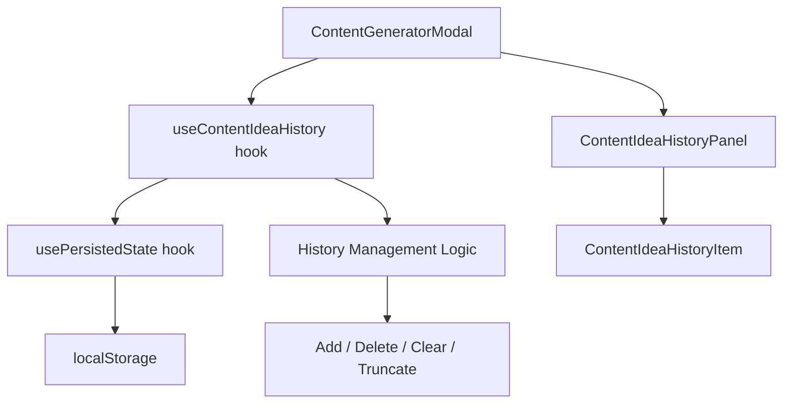

# Design Document: Content Idea History

## Overview

This feature adds persistence and browsing capabilities for AI-generated content ideas in the XaWars RNG application. Currently, the `ContentGeneratorModal` produces a `ContentIdea` object that is lost when a new idea is generated or the modal is closed. This design introduces a history system that automatically saves generated ideas to localStorage and provides a browsable history panel within the existing modal.

The design leverages the existing `usePersistedState` hook for localStorage persistence and follows the established component patterns in the project. The history is capped at 50 entries to prevent unbounded localStorage growth, with automatic eviction of the oldest entry when the cap is reached.

## Architecture

The feature follows a client-side state management pattern using React hooks and localStorage. No server-side components are needed.



### Key Design Decisions

1. **Custom hook (`useContentIdeaHistory`)**: Encapsulates all history logic (add, delete, clear, capacity management) in a reusable hook that wraps `usePersistedState`. This keeps the modal component lean and makes the logic independently testable.

2. **Inline history panel**: The history panel is rendered inside the `ContentGeneratorModal` as a toggled view rather than a separate modal. This keeps the user in context and avoids modal stacking.

3. **UUID v4 for entry IDs**: Each saved idea gets a UUID v4 identifier (generated via `crypto.randomUUID()`) to ensure uniqueness without relying on timestamps or array indices.

4. **Eager save on generation**: Ideas are saved immediately upon successful generation, not on user action. This ensures no idea is lost.

## Components and Interfaces

### New Components

#### `ContentIdeaHistoryPanel`
A panel component that displays the list of saved ideas with preview text and timestamps.

**Props:**
```typescript
interface ContentIdeaHistoryPanelProps {
  entries: SavedContentIdea[];
  onSelect: (entry: SavedContentIdea) => void;
  onDelete: (id: string) => void;
  onClearAll: () => void;
}
```

**Responsibilities:**
- Render the list of saved ideas in reverse chronological order
- Display truncated preview (100 chars max with ellipsis)
- Display relative/absolute timestamps
- Handle empty state messaging
- Provide delete button per entry and a "Clear All" action with confirmation

### Modified Components

#### `ContentGeneratorModal`
**Changes:**
- Add a history toggle button in the header area
- Accept history hook state and callbacks as props (or use the hook internally)
- Conditionally render `ContentIdeaHistoryPanel` or the current content view
- Disable history toggle while generating
- When an idea is selected from history, display it in the content area

### New Hook

#### `useContentIdeaHistory`
```typescript
interface UseContentIdeaHistoryReturn {
  entries: SavedContentIdea[];
  addEntry: (idea: ContentIdea) => { success: boolean; error?: string };
  deleteEntry: (id: string) => void;
  clearAll: () => void;
  storageError: string | null;
}
```

**Responsibilities:**
- Wraps `usePersistedState` with key `'content-idea-history'`
- Prepends new entries with UUID and ISO timestamp
- Enforces 50-entry cap with oldest-first eviction
- Truncates on load if stored data exceeds 50 entries
- Surfaces localStorage errors without crashing

### Utility Functions

#### `formatRelativeTime(isoTimestamp: string): string`
Formats a timestamp as relative time ("2 minutes ago") for timestamps < 7 days old, or absolute date ("Jan 15, 2025") for older timestamps.

#### `truncatePreview(text: string, maxLength: number): string`
Truncates text to `maxLength` characters, appending "…" if truncated.

## Data Models

### `SavedContentIdea`
```typescript
interface SavedContentIdea {
  id: string;                                    // UUID v4
  savedAt: string;                               // ISO 8601 UTC timestamp
  contentIdea: string;                           // Original content idea text
  titleVariations: [string, string, string];     // 3 title options
  storyHook: string;                             // Opening hook
  missionDirective: string;                      // Call-to-action
  thumbnailPrompts: [string, string, string];    // 3 thumbnail descriptions
}
```

### localStorage Schema

**Key:** `'content-idea-history'`

**Value:** JSON-serialized `SavedContentIdea[]` (ordered newest-first, max 50 entries)

Example:
```json
[
  {
    "id": "a1b2c3d4-e5f6-7890-abcd-ef1234567890",
    "savedAt": "2025-01-15T10:30:00.000Z",
    "contentIdea": "Challenge video where...",
    "titleVariations": ["Title A", "Title B", "Title C"],
    "storyHook": "What if I told you...",
    "missionDirective": "Drop a comment below...",
    "thumbnailPrompts": ["Close-up of...", "Split screen...", "Action shot..."]
  }
]
```


## Correctness Properties

*A property is a characteristic or behavior that should hold true across all valid executions of a system — essentially, a formal statement about what the system should do. Properties serve as the bridge between human-readable specifications and machine-verifiable correctness guarantees.*

### Property 1: Add entry prepends with valid metadata

*For any* valid ContentIdea, adding it to the history should result in the new entry appearing at index 0 of the history array, with an `id` matching UUID v4 format (`/^[0-9a-f]{8}-[0-9a-f]{4}-4[0-9a-f]{3}-[89ab][0-9a-f]{3}-[0-9a-f]{12}$/i`), a `savedAt` field that is a valid ISO 8601 UTC string, and all original ContentIdea fields intact.

**Validates: Requirements 1.1, 1.4**

### Property 2: Save/retrieve round-trip preserves all fields

*For any* valid ContentIdea with arbitrary string content in all fields, after saving to history and retrieving the entry at index 0, the fields `contentIdea`, `titleVariations`, `storyHook`, `missionDirective`, and `thumbnailPrompts` should be deeply equal to the original input.

**Validates: Requirements 1.3**

### Property 3: Timestamp formatting rules

*For any* ISO 8601 timestamp, `formatRelativeTime` should return a relative time string (e.g., "2 minutes ago", "3 days ago") when the timestamp is less than 7 days before the current time, and an absolute date string (e.g., "Jan 15, 2025") when the timestamp is 7 days or older.

**Validates: Requirements 2.3**

### Property 4: Text truncation

*For any* string, `truncatePreview(text, 100)` should return the original string unchanged if its length is ≤ 100 characters, or return the first 100 characters followed by "…" if the original string length exceeds 100 characters.

**Validates: Requirements 2.4**

### Property 5: Delete removes exactly the target entry

*For any* non-empty history and any entry ID present in that history, calling `deleteEntry(id)` should result in a history that no longer contains an entry with that ID, has length decreased by exactly 1, and preserves all other entries in their original order.

**Validates: Requirements 3.1**

### Property 6: History length invariant

*For any* sequence of add operations applied to an initially empty history, the history length should never exceed 50 entries.

**Validates: Requirements 4.1**

### Property 7: Eviction removes oldest when at capacity

*For any* history containing exactly 50 entries and any new valid ContentIdea, after adding the new entry, the history should still contain exactly 50 entries, the new entry should be at index 0, and the entry that was previously at index 49 (the oldest) should no longer be present.

**Validates: Requirements 4.2**

### Property 8: Load truncation to 50 most recent

*For any* array of N SavedContentIdea entries where N > 50, sorted by savedAt descending, after the truncation logic is applied, the result should contain exactly 50 entries and they should be the 50 entries with the most recent `savedAt` values from the original array.

**Validates: Requirements 4.3**

## Error Handling

| Scenario | Behavior | User Feedback |
|----------|----------|---------------|
| localStorage write fails on save | Retain idea in session state, set `storageError` | Toast/inline message: "Idea saved to session but could not be persisted. It may be lost on page refresh." |
| localStorage write fails on eviction/truncation | Retain in-memory state, set `storageError` | Same as above |
| localStorage read fails on mount | Initialize with empty history, log error | Silent — user sees empty history |
| `crypto.randomUUID()` unavailable | Fallback to `Date.now().toString(36) + Math.random().toString(36).slice(2)` | Silent |
| Stored data is corrupted/unparseable | Reset to empty history, log error | Silent — user sees empty history |

### Error Handling Strategy

- All localStorage operations are wrapped in try/catch within the `usePersistedState` hook (already implemented).
- The `useContentIdeaHistory` hook adds an additional `storageError` state that surfaces write failures to the UI layer.
- The `ContentGeneratorModal` conditionally renders an error banner when `storageError` is non-null.
- Errors are non-blocking — the user can continue generating and viewing ideas in the current session regardless of persistence failures.

## Testing Strategy

### Unit Tests (Example-Based)

- **localStorage error handling**: Mock `localStorage.setItem` to throw, verify session state is preserved and error is surfaced (Requirements 1.5, 4.4)
- **Clear all with confirmation**: Verify confirmation prompt appears, confirm clears history, cancel preserves history (Requirements 3.2, 3.3, 3.4)
- **UI rendering**: History toggle exists in header, panel visibility toggles, empty state message displays, toggle disabled during generation (Requirements 5.1, 5.3, 5.4)
- **Selection behavior**: Selecting an entry closes panel and displays full content with CopyButtons (Requirements 2.2, 5.2, 5.5)
- **Display order**: Rendered list matches newest-first order (Requirement 2.1)

### Property-Based Tests

Property-based tests use `fast-check` (already installed in the project) with a minimum of 100 iterations per property.

| Property | Test File | Tag |
|----------|-----------|-----|
| Property 1: Add entry prepends with valid metadata | `useContentIdeaHistory.property.test.ts` | Feature: content-idea-history, Property 1: Add entry prepends with valid metadata |
| Property 2: Save/retrieve round-trip | `useContentIdeaHistory.property.test.ts` | Feature: content-idea-history, Property 2: Save/retrieve round-trip preserves all fields |
| Property 3: Timestamp formatting rules | `formatRelativeTime.property.test.ts` | Feature: content-idea-history, Property 3: Timestamp formatting rules |
| Property 4: Text truncation | `truncatePreview.property.test.ts` | Feature: content-idea-history, Property 4: Text truncation |
| Property 5: Delete removes exactly the target entry | `useContentIdeaHistory.property.test.ts` | Feature: content-idea-history, Property 5: Delete removes exactly the target entry |
| Property 6: History length invariant | `useContentIdeaHistory.property.test.ts` | Feature: content-idea-history, Property 6: History length invariant |
| Property 7: Eviction removes oldest when at capacity | `useContentIdeaHistory.property.test.ts` | Feature: content-idea-history, Property 7: Eviction removes oldest when at capacity |
| Property 8: Load truncation to 50 most recent | `useContentIdeaHistory.property.test.ts` | Feature: content-idea-history, Property 8: Load truncation to 50 most recent |

### Test Configuration

- **Library**: `fast-check` v4.8.0 (already in devDependencies)
- **Runner**: `vitest` v4.1.6 (already configured)
- **Iterations**: Minimum 100 per property test (`fc.assert(property, { numRuns: 100 })`)
- **Generators**: Custom `fc.record()` generators for `ContentIdea` and `SavedContentIdea` objects with appropriate constraints (3-element tuples for titleVariations/thumbnailPrompts, non-empty strings, valid ISO timestamps)

### Integration Tests

- Full flow: generate idea → verify it appears in history → select from history → verify display → delete → verify removal
- localStorage persistence: add entries, simulate page reload (re-mount hook), verify entries are restored
