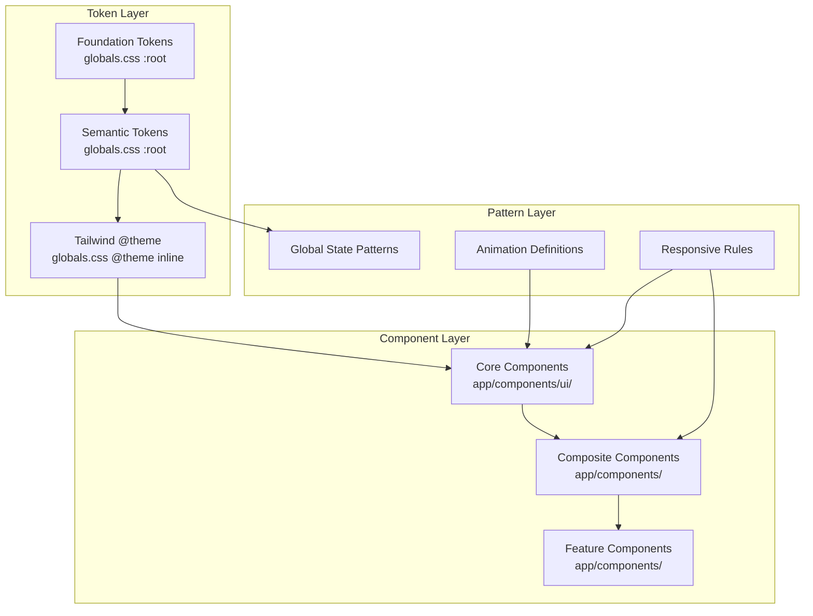
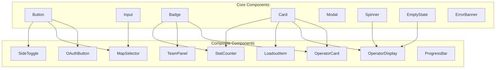

# Design Document: XAWARS Design System

## Overview

The XAWARS Design System is a comprehensive set of design tokens, component patterns, and interaction guidelines that govern the visual language of the XAWARS application — a Rainbow Six Siege operator randomizer and content creation tool. The system is built on Next.js 16, Tailwind CSS v4, and uses a dark-mode-only tactical gaming aesthetic.

The design system is structured in layers:
1. **Foundation Tokens** — Raw color values as CSS custom properties
2. **Semantic Tokens** — Purpose-driven mappings from foundation to UI role
3. **Component Primitives** — Reusable UI building blocks (Button, Input, Modal, etc.)
4. **Composite Components** — Feature-aware compositions of primitives
5. **Patterns** — Shared visual treatments for global states, animations, and layouts

This layered approach ensures that brand changes propagate from a single source, components remain decoupled from specific color values, and the entire UI maintains visual coherence as the application grows.

### Key Design Decisions

| Decision | Choice | Rationale |
|----------|--------|-----------|
| Dark mode only | No light mode variant | Gaming audience expects dark UI; eliminates theme-switching complexity |
| Tailwind v4 @theme | CSS custom properties + utility classes | Native CSS variables for tokens; Tailwind utilities for rapid composition |
| Geist font family | Sans for UI, Mono for data | Clean modern sans pairs well with tactical aesthetic; mono reinforces technical/data feel |
| Yellow-500 accent | Primary brand color | High contrast on dark backgrounds; evokes caution/action in gaming context |
| Lucide React icons | Sole icon library | Consistent stroke weight; tree-shakeable; covers all UI icon needs |
| r6operators library | Operator-specific icons only | Official R6 operator SVGs; separate from UI icon system |
| fast-check for PBT | Property-based testing library | Already in project dependencies; validates token/component logic |

## Architecture

The design system is organized as a set of co-located modules within the existing Next.js app structure:



### File Organization

```
app/
├── globals.css              # Foundation tokens, semantic tokens, @theme, animations
├── components/
│   ├── ui/                  # Core Components (Button, Input, Modal, Badge, etc.)
│   │   ├── Button.tsx
│   │   ├── Input.tsx
│   │   ├── Select.tsx
│   │   ├── Modal.tsx
│   │   ├── Badge.tsx
│   │   ├── Card.tsx
│   │   ├── Spinner.tsx
│   │   ├── Divider.tsx
│   │   ├── EmptyState.tsx
│   │   ├── ErrorBanner.tsx
│   │   └── index.ts         # Barrel export
│   ├── OperatorCard.tsx      # Composite Component
│   ├── OperatorDisplay.tsx   # Composite Component
│   └── ...
├── lib/
│   └── design-tokens.ts     # Token type definitions and validation utilities
└── data/
    └── types.ts             # Shared type definitions
```

### Token Resolution Flow

```mermaid
flowchart LR
    A[Foundation Token<br/>--color-yellow-500: #eab308] --> B[Semantic Token<br/>--color-accent: var(--color-yellow-500)]
    B --> C[Tailwind @theme<br/>--color-accent: var(--color-accent)]
    C --> D[Component Usage<br/>className="bg-accent"]
```

This three-layer indirection means:
- Changing the brand accent from yellow to another color requires updating only `--color-yellow-500` or remapping `--color-accent`
- Components never reference raw hex values
- Tailwind utilities automatically reflect token changes

## Components and Interfaces

### Core Component Interfaces

All core components follow a shared contract:

```typescript
// Shared props for all interactive components
interface InteractiveComponentProps {
  disabled?: boolean;
  loading?: boolean;
  className?: string;
}

// Button component interface
interface ButtonProps extends React.ButtonHTMLAttributes<HTMLButtonElement>, InteractiveComponentProps {
  variant?: 'primary' | 'danger' | 'outline' | 'ghost';
  size?: 'sm' | 'md' | 'lg';
  icon?: LucideIcon;
  children: React.ReactNode;
}

// Input component interface
interface InputProps extends React.InputHTMLAttributes<HTMLInputElement>, InteractiveComponentProps {
  label?: string;
  error?: string;
  helperText?: string;
}

// Select component interface
interface SelectProps extends React.SelectHTMLAttributes<HTMLSelectElement>, InteractiveComponentProps {
  label?: string;
  error?: string;
  options: Array<{ value: string; label: string }>;
}

// Modal component interface
interface ModalProps {
  isOpen: boolean;
  onClose: () => void;
  title?: string;
  children: React.ReactNode;
  className?: string;
}

// Badge component interface
interface BadgeProps {
  variant?: 'default' | 'attack' | 'defense' | 'success' | 'error' | 'warning';
  size?: 'sm' | 'md';
  children: React.ReactNode;
  className?: string;
}

// Card component interface
interface CardProps {
  variant?: 'default' | 'elevated' | 'interactive';
  padding?: 'sm' | 'md' | 'lg';
  children: React.ReactNode;
  className?: string;
}

// EmptyState component interface
interface EmptyStateProps {
  message?: string;
  action?: React.ReactNode;
  minHeight?: string;
  className?: string;
}

// ErrorBanner component interface
interface ErrorBannerProps {
  message: string;
  onRetry?: () => void;
  onDismiss?: () => void;
  className?: string;
}

// Spinner component interface
interface SpinnerProps {
  size?: 'sm' | 'md' | 'lg';
  color?: 'primary' | 'white' | 'contextual';
  className?: string;
}
```

### Token Utility Interface

```typescript
// Design token validation and access utilities
interface DesignTokens {
  // Foundation token registry
  foundation: Record<string, string>;
  // Semantic token registry  
  semantic: Record<string, string>;
  // Validate that a color value references a known token
  isValidToken(value: string): boolean;
  // Resolve a semantic token to its foundation value
  resolveToken(semanticName: string): string | null;
  // Get the gaming context color for a given side
  getContextColor(side: 'attack' | 'defense'): string;
  // Get importance tier border class
  getImportanceBorder(tier: 'primary' | 'secondary' | 'niche'): string;
}
```

### Component Composition Pattern



## Data Models

### Foundation Token Registry

The foundation tokens are defined as CSS custom properties in `:root` and exposed through Tailwind's `@theme` directive:

```css
:root {
  /* Neutral Scale */
  --color-black: #000000;
  --color-zinc-900: #18181b;
  --color-zinc-800: #27272a;
  --color-zinc-700: #3f3f46;
  --color-zinc-600: #52525b;
  --color-zinc-500: #71717a;
  --color-zinc-400: #a1a1aa;
  --color-white: #ffffff;

  /* Brand Yellow */
  --color-yellow-500: #eab308;
  --color-yellow-400: #facc15;

  /* Attack Orange */
  --color-orange-500: #f97316;
  --color-orange-600: #ea580c;

  /* Defense Blue */
  --color-blue-500: #3b82f6;
  --color-blue-600: #2563eb;

  /* Success Green */
  --color-green-500: #22c55e;
  --color-green-400: #4ade80;

  /* Error Red */
  --color-red-500: #ef4444;
  --color-red-400: #f87171;
  --color-red-600: #dc2626;

  /* Semantic Tokens — Surfaces */
  --color-bg-primary: var(--color-black);
  --color-bg-surface: var(--color-zinc-900);
  --color-bg-elevated: var(--color-zinc-800);
  --color-bg-overlay: var(--color-zinc-700);

  /* Semantic Tokens — Text */
  --color-text-primary: var(--color-white);
  --color-text-secondary: var(--color-zinc-400);
  --color-text-muted: var(--color-zinc-500);
  --color-text-disabled: var(--color-zinc-600);

  /* Semantic Tokens — Accent */
  --color-accent: var(--color-yellow-500);
  --color-accent-hover: var(--color-yellow-400);

  /* Semantic Tokens — Borders */
  --color-border-default: var(--color-zinc-700);
  --color-border-hover: var(--color-zinc-500);
  --color-border-focus: var(--color-yellow-500);

  /* Semantic Tokens — States */
  --color-success: var(--color-green-500);
  --color-error: var(--color-red-500);
  --color-warning: #f59e0b; /* amber-500 */
  --color-info: var(--color-blue-500);
  --color-error-bg: rgb(239 68 68 / 0.1);
  --color-error-border: rgb(239 68 68 / 0.3);
  --color-error-text: var(--color-red-400);

  /* Semantic Tokens — Gaming Context */
  --color-attack: var(--color-orange-500);
  --color-attack-active: var(--color-orange-600);
  --color-defense: var(--color-blue-500);
  --color-defense-active: var(--color-blue-600);
}
```

### Typography Scale Model

| Role | Size | Weight | Transform | Tracking | Font | Usage |
|------|------|--------|-----------|----------|------|-------|
| Display | text-3xl / text-4xl | font-black | uppercase | tracking-tighter | Geist Sans | Operator names, hero headings |
| Heading | text-xl / text-2xl | font-bold | uppercase | — | Geist Sans | Section titles |
| Label | text-xs / text-[10px] | font-bold | uppercase | tracking-widest | Geist Sans | Field labels, categories |
| Body | text-sm / text-base | font-medium | none | — | Geist Sans | Descriptions, content |
| Caption | text-xs | font-medium | none | — | Geist Sans | Helper text, timestamps |
| Data | text-sm / text-xl | font-black | none | tracking-tight | Geist Mono | Stats, codes, loadouts |

### Spacing Scale

Based on Tailwind's 4px grid:

| Token | Value | Usage |
|-------|-------|-------|
| 1 | 4px | Icon-text gap (small) |
| 1.5 | 6px | Icon-text gap (buttons) |
| 2 | 8px | Icon-text gap (medium), inline spacing |
| 3 | 12px | Small padding, tight gaps |
| 4 | 16px | Standard padding (mobile), section gaps |
| 5 | 20px | Card padding (compact) |
| 6 | 24px | Card padding (standard), section spacing |
| 8 | 32px | Large section gaps |
| 10 | 40px | Page-level spacing |
| 12 | 48px | Major section breaks |
| 16 | 64px | Hero spacing |

### Elevation Model

| Level | Background | Border | Shadow | Z-Index | Usage |
|-------|-----------|--------|--------|---------|-------|
| 0 | black | none | none | z-0 | Page background |
| 1 | zinc-900 | zinc-700 | shadow-md | z-0 | Cards, panels |
| 2 | zinc-800 | zinc-700 | shadow-lg | z-20-50 | Modals, dropdowns |
| 3 | zinc-800 | zinc-600 | shadow-2xl | z-30-60 | Floating elements, toasts |

### Z-Index Layer Map

| Layer | Value | Elements |
|-------|-------|----------|
| Base | z-0 | Page content, cards, panels |
| Sticky | z-10 | Sticky headers, navigation |
| Dropdown | z-20 | Dropdowns, popovers |
| Float | z-30 | Floating action buttons |
| Backdrop | z-40 | Modal backdrops |
| Modal | z-50 | Modal content |
| Toast | z-[60] | Toast notifications |

### Animation Timing Model

| Category | Duration | Easing | Usage |
|----------|----------|--------|-------|
| Micro | 200ms | ease | Hover, focus, color transitions |
| Standard | 300ms | ease-out | Element enter/exit, layout shifts |
| Dramatic | 1000-2000ms | ease-out / ease-in-out | Ken-burns background, shimmer loading |

### Breakpoint Model

| Name | Width | Layout Behavior |
|------|-------|-----------------|
| Base | 0-639px | Single column, p-4, stacked layouts |
| sm | 640px+ | Form layouts expand, minor grid adjustments |
| md | 768px+ | Content grids go multi-column |
| lg | 1024px+ | Full desktop layout, sidebars appear |
| xl | 1280px+ | Maximum content width, generous spacing |

### Component Variant Model

```typescript
// Button variants with their style mappings
type ButtonVariantStyles = {
  primary: { bg: 'yellow-500', hoverBg: 'yellow-400', text: 'black', shadow: 'yellow-500/20' };
  danger: { bg: 'red-600', hoverBg: 'red-500', text: 'white', shadow: 'red-600/20' };
  outline: { bg: 'transparent', border: 'white/20', hoverBorder: 'white/50', text: 'white' };
  ghost: { bg: 'transparent', text: 'white/60', hoverText: 'white' };
};

// Badge variants with their style mappings
type BadgeVariantStyles = {
  default: { bg: 'zinc-800', text: 'zinc-300', border: 'zinc-700' };
  attack: { bg: 'orange-500/10', text: 'orange-400', border: 'orange-500/30' };
  defense: { bg: 'blue-500/10', text: 'blue-400', border: 'blue-500/30' };
  success: { bg: 'green-500/10', text: 'green-400', border: 'green-500/30' };
  error: { bg: 'red-500/10', text: 'red-400', border: 'red-500/30' };
  warning: { bg: 'amber-500/10', text: 'amber-400', border: 'amber-500/30' };
};

// Gaming context model
type GamingContext = {
  side: 'attack' | 'defense';
  accentColor: string;
  activeColor: string;
  glowShadow: string;
};

// Operator importance tiers
type ImportanceTier = 'primary' | 'secondary' | 'niche';
type ImportanceBorderMap = Record<ImportanceTier, string>;
```

## Correctness Properties

*A property is a characteristic or behavior that should hold true across all valid executions of a system — essentially, a formal statement about what the system should do. Properties serve as the bridge between human-readable specifications and machine-verifiable correctness guarantees.*

### Property 1: Semantic Token Resolution

*For any* semantic token in the design system registry, resolving it through the token chain should produce the exact hex value of the foundation token it references. Furthermore, *for any* valid hex color assigned to a foundation token, all semantic tokens referencing that foundation token should resolve to the updated value without requiring changes to semantic token names or component code.

**Validates: Requirements 2.1, 2.4**

### Property 2: Button Variant and Size Rendering

*For any* valid combination of button variant ('primary' | 'danger' | 'outline' | 'ghost') and size ('sm' | 'md' | 'lg'), the Button component should render with the correct CSS classes for background, text color, shadow, padding, font-size, and gap as defined in the variant/size style maps. Additionally, *for any* button with an icon prop, the icon should appear before the text content with a gap matching the size (gap-1.5 for sm, gap-2 for md/lg).

**Validates: Requirements 4.1, 4.2, 9.4**

### Property 3: Error Accessibility Semantics

*For any* non-empty error string passed to a form component (Input, Select) or ErrorBanner, the rendered output should include: an element with `role="alert"` containing the error text, `aria-invalid="true"` on the associated input element, and an `aria-describedby` attribute on the input pointing to the error message element's id.

**Validates: Requirements 5.3, 12.5, 14.3**

### Property 4: Interactive Component Focus Indicators

*For any* interactive component (Button, Input, Select, or any element with onClick/onChange handlers), the rendered output should include visible focus indicator classes (`focus:ring-2 focus:ring-yellow-500 focus:ring-offset-2 focus:ring-offset-zinc-900` or equivalent) meeting WCAG AA requirements.

**Validates: Requirements 11.5, 4.5**

### Property 5: className Prop Passthrough

*For any* core component (Button, Input, Select, Modal, Badge, Card, Spinner, EmptyState, ErrorBanner) and *for any* valid CSS class string passed as the `className` prop, that class string should appear in the rendered component's class attribute without overriding the component's base styles.

**Validates: Requirements 12.1**

### Property 6: Uppercase Tracking Consistency

*For any* component element that applies the `uppercase` CSS class, that same element (or its parent) should also include either `tracking-wider` or `tracking-widest` — plain uppercase without tracking adjustment is never rendered.

**Validates: Requirements 11.2, 3.3**

### Property 7: Gaming Context Color Resolution

*For any* valid side value ('attack' | 'defense'), the context color utility should return the correct accent color (orange-500 for attack, blue-500 for defense). Additionally, *for any* valid importance tier ('primary' | 'secondary' | 'niche'), the importance border utility should return the correct border class (border-yellow-500/30, border-zinc-700, border-zinc-700/50 respectively).

**Validates: Requirements 17.1, 17.2, 17.3**

### Property 8: Delta Indicator Correctness

*For any* numeric value representing a change delta: positive values should render with green-400 color and an upward arrow indicator, negative values should render with red-400 color and a downward arrow indicator, and zero values should render with zinc-400 color and no directional indicator.

**Validates: Requirements 18.3**

### Property 9: Decorative Icon Accessibility

*For any* icon rendered in a decorative context (accompanying text that already conveys meaning), the icon element should have `aria-hidden="true"` set. *For any* icon rendered as the sole content of an interactive element (icon-only button), the parent element should have an `aria-label` attribute with descriptive text.

**Validates: Requirements 20.5, 9.2**


## Error Handling

### Component-Level Error Handling

| Scenario | Behavior | Visual Treatment |
|----------|----------|-----------------|
| Invalid variant prop | Fall back to 'primary' (Button) or 'default' (Badge/Card) | No visual error — graceful degradation |
| Missing required children | Render empty container with minimum dimensions | Prevents layout collapse |
| Image load failure (operator bg) | Display gradient fallback matching side context | Orange gradient for attack, blue for defense |
| Icon not found in r6operators | Render initial letter in circular fallback | bg-white/10 rounded-full with first letter |
| Form validation error | Display error below field with role="alert" | red-400 text, border-red-500/30 container |
| Network offline | Persistent top banner with reconnection indicator | bg-zinc-800, border-b border-zinc-700 |

### Error State Hierarchy

1. **Field-level errors** — Inline below the affected input, red-400 text with role="alert"
2. **Section-level errors** — ErrorBanner within the relevant card/panel, with optional retry action
3. **Page-level errors** — Full-width banner at top of content area, assertive aria-live
4. **Global errors** — Persistent overlay or toast at z-[60], auto-dismiss for transient issues

### Error Recovery Patterns

- **Retry action**: ErrorBanner includes an optional `onRetry` callback rendered as a ghost button
- **Dismiss action**: Non-critical errors include an `onDismiss` callback (X icon button)
- **Auto-dismiss**: Success and transient error toasts auto-dismiss after 3 seconds
- **Persistent errors**: Network/auth errors remain visible until the condition resolves

### Graceful Degradation

- Components with missing optional props render in a sensible default state
- Token resolution failures fall back to the closest semantic token (e.g., if `--color-accent` is undefined, use `--color-yellow-500` directly)
- Animation failures (missing keyframes) result in instant state changes rather than broken transitions
- Font loading failures fall back to system sans-serif (already handled by Next.js font optimization)

## Testing Strategy

### Dual Testing Approach

The design system uses both unit tests and property-based tests for comprehensive coverage:

- **Unit tests (example-based)**: Verify specific component rendering, edge cases, accessibility attributes, and visual state combinations
- **Property-based tests**: Verify universal properties that must hold across all valid inputs (token resolution, variant rendering, accessibility semantics)

### Property-Based Testing Configuration

- **Library**: fast-check (already in project devDependencies)
- **Framework**: Vitest with @testing-library/react
- **Minimum iterations**: 100 per property test
- **Tag format**: `Feature: design-system, Property {number}: {property_text}`

Each correctness property maps to a single property-based test:

| Property | Test File | What Varies |
|----------|-----------|-------------|
| 1: Token Resolution | `design-tokens.property.test.ts` | Semantic token names, foundation hex values |
| 2: Button Variant/Size | `Button.property.test.tsx` | Variant × size × icon combinations |
| 3: Error Accessibility | `form-accessibility.property.test.tsx` | Error message strings, input types |
| 4: Focus Indicators | `focus-indicators.property.test.tsx` | Component types, interaction states |
| 5: className Passthrough | `className-passthrough.property.test.tsx` | Component types, arbitrary class strings |
| 6: Uppercase Tracking | `typography-consistency.property.test.tsx` | Components with uppercase text |
| 7: Gaming Context Colors | `gaming-context.property.test.ts` | Side values, importance tiers |
| 8: Delta Indicators | `delta-indicators.property.test.tsx` | Positive/negative/zero numeric values |
| 9: Icon Accessibility | `icon-accessibility.property.test.tsx` | Decorative vs informational icon contexts |

### Unit Test Coverage

Unit tests cover specific examples and edge cases not suited to property testing:

| Area | Test Focus |
|------|-----------|
| Component rendering | Each core component renders without errors |
| Disabled state | Visual and functional disabled behavior |
| Loading state | Spinner display, interaction prevention |
| Empty state | Correct pattern with dashed border and messaging |
| Responsive classes | Breakpoint-specific class application |
| Animation classes | Correct keyframe references |
| Modal behavior | Focus trap, Escape key, backdrop click |
| Reduced motion | Animation disabling with prefers-reduced-motion |

### Test File Organization

```
app/
├── components/
│   └── ui/
│       └── __tests__/
│           ├── Button.test.tsx              # Unit tests
│           ├── Button.property.test.tsx     # Property 2
│           ├── Input.test.tsx               # Unit tests
│           ├── Modal.test.tsx               # Unit tests
│           ├── form-accessibility.property.test.tsx  # Property 3
│           ├── focus-indicators.property.test.tsx    # Property 4
│           ├── className-passthrough.property.test.tsx # Property 5
│           ├── typography-consistency.property.test.tsx # Property 6
│           ├── icon-accessibility.property.test.tsx    # Property 9
│           └── delta-indicators.property.test.tsx      # Property 8
├── lib/
│   └── __tests__/
│       ├── design-tokens.property.test.ts   # Property 1
│       └── gaming-context.property.test.ts  # Property 7
```

### What Is NOT Property Tested

The following areas use example-based unit tests or smoke tests only:

- **CSS custom property existence** — Smoke test verifying globals.css contains expected tokens
- **Animation keyframe definitions** — Smoke test verifying @keyframes exist
- **Responsive layout behavior** — Example-based tests with specific viewport sizes
- **Modal focus trapping** — Example-based DOM interaction tests
- **prefers-reduced-motion** — Example-based media query verification
- **Visual regression** — Not automated; relies on manual review and future visual regression tooling
