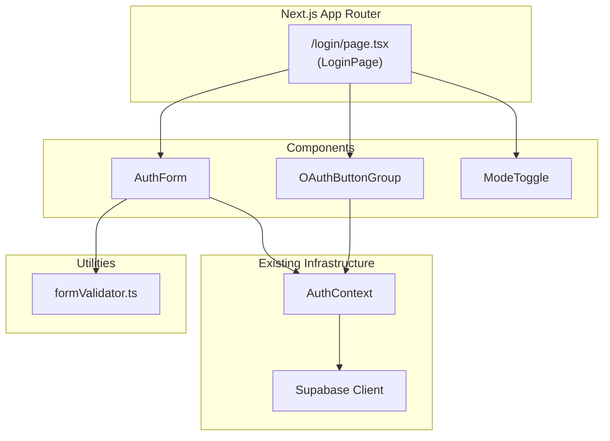

# Design Document: Login/Signup Page

## Overview

This design adds a dedicated authentication page at `/login` for the XA Wars RNG app. The page provides email/password login and signup, OAuth social login (Google, Discord), client-side form validation, and proper loading/redirect states. It integrates with the existing `AuthContext` and Supabase backend, reuses the app's dark gaming visual theme, and follows accessibility best practices.

The implementation is a single Next.js page route (`app/login/page.tsx`) composed of several focused client components. No new backend or API routes are needed since all auth operations are handled by the existing `AuthContext` which wraps Supabase client-side SDK calls.

## Architecture



**Key architectural decisions:**

1. **Single page route with client components**: The `/login` route is a single `'use client'` page that manages auth mode state (login vs signup) and delegates to child components. This keeps routing simple and avoids unnecessary server components for a fully interactive page.

2. **Pure validation utility**: Form validation logic lives in a separate `formValidator.ts` module with pure functions. This makes validation independently testable via property-based tests without DOM dependencies.

3. **Reuse existing AuthContext**: All auth operations (signIn, signUp, signInWithOAuth) are called through the existing `useAuth()` hook. No new auth logic is introduced.

4. **Redirect via `useRouter`**: Navigation after successful auth or when already authenticated uses Next.js `useRouter().push()`. A `returnUrl` query parameter preserves the originally requested URL for post-auth redirect.

## Components and Interfaces

### LoginPage (`app/login/page.tsx`)

The top-level page component. Manages:
- Auth mode state (`'login' | 'signup'`)
- Loading/redirect detection via `useAuth().isLoading` and `useAuth().session`
- Server error state from auth operations
- Return URL extraction from query params

```typescript
'use client';

// State
type AuthMode = 'login' | 'signup';

interface LoginPageState {
  mode: AuthMode;
  serverError: string | null;
  isSubmitting: boolean;
  oauthLoading: 'google' | 'discord' | null;
}
```

### AuthForm (`app/components/auth/AuthForm.tsx`)

Handles email/password input, client-side validation, and form submission.

```typescript
interface AuthFormProps {
  mode: AuthMode;
  onSubmit: (email: string, password: string) => Promise<void>;
  isSubmitting: boolean;
  serverError: string | null;
  onFieldChange: () => void; // clears server error when user edits
}
```

### OAuthButtonGroup (`app/components/auth/OAuthButtonGroup.tsx`)

Renders Google and Discord OAuth buttons with loading states.

```typescript
interface OAuthButtonGroupProps {
  onOAuthClick: (provider: 'google' | 'discord') => Promise<void>;
  loadingProvider: 'google' | 'discord' | null;
  disabled: boolean;
}
```

### ModeToggle (`app/components/auth/ModeToggle.tsx`)

A text link/button to switch between login and signup modes.

```typescript
interface ModeToggleProps {
  mode: AuthMode;
  onToggle: () => void;
}
```

### Form Validator (`app/lib/form-validator.ts`)

Pure validation functions for the auth form.

```typescript
interface ValidationErrors {
  email?: string;
  password?: string;
}

function validateLoginForm(email: string, password: string): ValidationErrors;
function validateSignupForm(email: string, password: string): ValidationErrors;
function isValidEmail(email: string): boolean;
```

**Validation rules:**
- Email required: non-empty after trim
- Email format: must contain exactly one `@` followed by a domain with at least one `.`
- Password required: non-empty
- Password length (signup only): minimum 8 characters

## Data Models

This feature introduces no new persistent data models. It operates on the existing `AuthState`, `AuthResult`, `User`, and `Session` types from `app/types/auth.ts`.

**Form state (transient, component-local):**

```typescript
interface FormFields {
  email: string;
  password: string;
}

interface FormState {
  fields: FormFields;
  validationErrors: ValidationErrors;
  serverError: string | null;
  isSubmitting: boolean;
}
```

**Query parameter contract:**
- `returnUrl` (optional): The URL to redirect to after successful authentication. Defaults to `/` if absent.


## Correctness Properties

*A property is a characteristic or behavior that should hold true across all valid executions of a system — essentially, a formal statement about what the system should do. Properties serve as the bridge between human-readable specifications and machine-verifiable correctness guarantees.*

### Property 1: Email validation correctness

*For any* string, `isValidEmail` SHALL return `true` if and only if the string contains exactly one `@` character, followed by a domain portion that contains at least one `.` character with non-empty labels on each side.

**Validates: Requirements 4.2**

### Property 2: Password length validation in signup mode

*For any* string of length less than 8, `validateSignupForm` SHALL return a password error containing "Password must be at least 8 characters". *For any* string of length 8 or greater, `validateSignupForm` SHALL NOT return this specific password length error.

**Validates: Requirements 4.4**

### Property 3: Simultaneous validation errors

*For any* form submission with multiple invalid fields (e.g., invalid email AND invalid password), `validateLoginForm` and `validateSignupForm` SHALL return error messages for ALL invalid fields simultaneously, never short-circuiting after the first error.

**Validates: Requirements 4.6**

### Property 4: Mode switch clears all form state

*For any* combination of email value, password value, validation errors, and server error present in the form, switching auth mode SHALL result in all input fields being empty, all validation errors being cleared, and the server error being null.

**Validates: Requirements 2.2**

### Property 5: Server error clears on field modification while preserving values

*For any* server error message displayed and any set of field values, modifying any single input field SHALL clear the server error message while preserving the values of all other input fields.

**Validates: Requirements 5.2, 5.4**

### Property 6: Login credential passthrough

*For any* valid email and password (passing client-side validation), submitting the form in login mode SHALL call `signIn` with exactly the email and password the user entered, unmodified.

**Validates: Requirements 3.2**

### Property 7: Signup credential passthrough

*For any* valid email and password of length >= 8 (passing client-side validation), submitting the form in signup mode SHALL call `signUp` with exactly the email and password the user entered, unmodified.

**Validates: Requirements 3.3**

### Property 8: Return URL preservation

*For any* valid relative URL path provided as the `returnUrl` query parameter, after successful authentication the page SHALL redirect to that exact path instead of the default `/` route.

**Validates: Requirements 1.4**

### Property 9: Focus moves to first errored field

*For any* form submission that produces validation errors on one or more fields, focus SHALL move to the first field (in DOM order: email before password) that has a validation error.

**Validates: Requirements 8.4**

## Error Handling

### Client-Side Validation Errors

- Validation runs on form submit (not on blur) to avoid premature error display
- All validation errors are displayed simultaneously — the validator does not short-circuit
- Errors are rendered adjacent to their corresponding input field using `aria-describedby`
- Errors clear when the user switches auth mode

### Server/Auth Errors

- Auth errors from `signIn`, `signUp`, and `signInWithOAuth` are displayed in a dedicated alert area (`role="alert"`) above the submit button
- The existing `mapAuthError` function in AuthContext already maps Supabase errors to user-friendly messages (network errors, invalid credentials, duplicate email)
- Server errors clear when the user modifies any input field, reducing stale error confusion
- Field values are always preserved after server errors so users don't need to retype

### OAuth Errors

- OAuth errors from `signInWithOAuth` are caught and displayed in the same alert area
- Both OAuth buttons are re-enabled after an error so the user can retry
- Since OAuth redirects to an external provider, network errors during the redirect are handled by the browser

### Loading States

- During form submission: submit button disabled, loading spinner shown on button
- During OAuth: both OAuth buttons disabled, spinner on the clicked button
- During initial auth check (`isLoading`): full-page loading indicator replaces the form entirely

### Edge Cases

- If the user is already authenticated when the page loads, redirect immediately without showing the form
- If the session expires while on the login page (unlikely but possible), the page remains functional
- If `returnUrl` contains an invalid or external URL, fall back to `/` for security

## Testing Strategy

### Unit Tests (Example-Based)

Unit tests cover specific scenarios, rendering checks, and integration points:

- **Routing**: Page renders at `/login`, redirects when session exists
- **Rendering**: Correct elements present (inputs, buttons, labels, divider)
- **Mode toggle**: Defaults to login, switches modes, shows correct button labels
- **Accessibility**: Labels associated with inputs, ARIA roles on errors, focus on load, tab order
- **Loading states**: Loading indicator shown during `isLoading`, buttons disabled during submission
- **OAuth**: Correct provider passed on click, error display, button disable during loading
- **Success paths**: Redirect after successful login/signup

### Property-Based Tests (Universal Properties)

Property-based tests use `fast-check` (already in devDependencies) to verify universal correctness properties across generated inputs. Each property test runs a minimum of 100 iterations.

**Pure validation properties** (no DOM needed):
- Property 1: Email validation correctness — generate random strings, verify `isValidEmail` matches the specification
- Property 2: Password length validation — generate random-length strings, verify length < 8 fails in signup mode
- Property 3: Simultaneous errors — generate random invalid form states, verify all errors returned

**Component behavior properties** (with React Testing Library):
- Property 4: Mode switch clears state — generate random field values, switch mode, verify cleared
- Property 5: Server error clearing — generate random errors and values, edit field, verify error clears
- Property 6: Login credential passthrough — generate valid credentials, verify signIn called with exact values
- Property 7: Signup credential passthrough — generate valid credentials (pw >= 8), verify signUp called with exact values
- Property 8: Return URL preservation — generate random URL paths, verify redirect target
- Property 9: Focus on first error — generate random invalid states, verify focus target

**Test configuration:**
- Library: `fast-check` v4.x (already installed)
- Runner: `vitest` (already configured)
- Minimum iterations: 100 per property
- Tag format: `Feature: login-signup-page, Property {N}: {title}`

### Test File Organization

```
app/
├── lib/
│   ├── form-validator.ts
│   └── __tests__/
│       ├── form-validator.test.ts          # Unit tests
│       └── form-validator.property.test.ts # Properties 1-3
├── login/
│   └── page.tsx
└── components/
    └── auth/
        ├── AuthForm.tsx
        ├── OAuthButtonGroup.tsx
        ├── ModeToggle.tsx
        └── __tests__/
            ├── AuthForm.test.tsx            # Unit tests
            ├── AuthForm.property.test.tsx   # Properties 4-7, 9
            ├── OAuthButtonGroup.test.tsx    # Unit tests
            └── LoginPage.property.test.tsx  # Property 8
```
