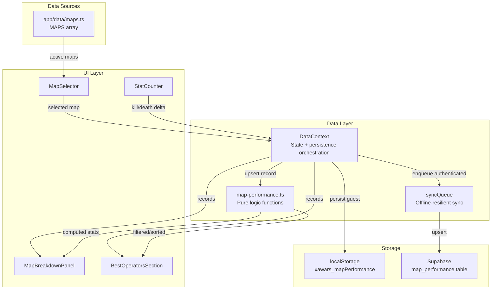

# Design Document: Map Performance Tracking

## Overview

Map Performance Tracking extends XAWARS RNG with per-map performance insights by introducing a map attribution layer on top of the existing kill/death recording system. Users select a map during active deployments, and the system accumulates per-operator-per-map statistics (kills, deaths, matches). These statistics surface in two places: the Mastery Detail Modal (per-operator map breakdown) and the Map Advisor (personalized "best operators on this map" recommendations).

The design follows the existing architecture patterns:
- **Data layer**: Pure functions for stat computation, `usePersistedState` for localStorage, Supabase via `syncQueue` for authenticated users
- **State management**: React Context (`DataContext`) for global data, local component state for UI-only concerns
- **Component structure**: Existing modal/panel patterns with Tailwind styling

### Key Design Decisions

1. **Map attribution at increment level, not deployment level** — A single deployment spans multiple matches on different maps. Map selection is a UI-level state that tags subsequent increments.
2. **Additive upsert semantics** — Performance records are never overwritten; deltas are always summed into existing totals. This prevents data loss from race conditions or duplicate operations.
3. **Threshold gating** — Statistics are only displayed when sufficient data exists (≥3 matches), preventing misleading insights from small samples.
4. **Graceful degradation** — The feature is entirely optional. Existing kill/death tracking without map attribution continues to work unchanged.

## Architecture



### Data Flow

1. **Recording**: User selects a map → increments kills/deaths → `DataContext` calls `upsertMapPerformance()` with the current operator, map, and delta
2. **Match counting**: User changes map selection → `DataContext` increments match count for the previous operator-map combination
3. **Display (Modal)**: User opens Mastery Detail Modal → `getMapBreakdown(operatorId, records)` returns sorted, threshold-filtered stats
4. **Display (Advisor)**: User selects map in Map Advisor → `getBestOperators(mapId, side, records)` returns top 5 qualifying operators
5. **Migration**: On guest→authenticated transition, `mergeMapPerformanceRecords(local, cloud)` produces summed records for upsert

## Components and Interfaces

### New Components

#### `MapSelector` (`app/components/MapSelector.tsx`)
A controlled `<select>` dropdown that displays active maps from the pool. Rendered alongside the kill/death counters during an active deployment.

```typescript
interface MapSelectorProps {
  selectedMapId: string | null;
  onMapChange: (mapId: string | null) => void;
  disabled?: boolean;
}
```

#### `MapBreakdownPanel` (`app/components/mastery/MapBreakdownPanel.tsx`)
A panel rendered within `MasteryDetailModal` showing per-map performance for a specific operator. Displays sorted map entries with threshold gating.

```typescript
interface MapBreakdownPanelProps {
  operatorId: string;
  records: MapPerformanceRecord[];
}
```

#### `BestOperatorsSection` (`app/components/BestOperatorsSection.tsx`)
A section rendered below community recommendations in `MapAdvisor`, showing the user's top-performing operators on the selected map.

```typescript
interface BestOperatorsSectionProps {
  mapId: string;
  side: 'attacker' | 'defender';
  records: MapPerformanceRecord[];
}
```

### Modified Components

- **`StatCounter` area** (parent component in `page.tsx`): Render `MapSelector` alongside the kill/death counters when a deployment is active
- **`MasteryDetailModal`**: Add `MapBreakdownPanel` between the stats grid and footer
- **`MapAdvisor`**: Add `BestOperatorsSection` below existing recommendation tiers

### New Library Module

#### `map-performance.ts` (`app/lib/map-performance.ts`)
Pure functions for map performance data transformations. No side effects, no I/O.

```typescript
// Core upsert logic
function upsertMapPerformance(
  records: Record<string, MapPerformanceRecord>,
  operatorId: string,
  mapId: string,
  delta: { kills?: number; deaths?: number; matches?: number }
): Record<string, MapPerformanceRecord>;

// Compute display stats for a single record
function computeMapStats(record: MapPerformanceRecord): MapDisplayStats | null;

// Get sorted map breakdown for an operator (max 10, sorted by K/D desc)
function getMapBreakdown(
  operatorId: string,
  records: Record<string, MapPerformanceRecord>
): MapBreakdownEntry[];

// Get best operators for a map and side (max 5, filtered by threshold)
function getBestOperators(
  mapId: string,
  side: 'attacker' | 'defender',
  records: Record<string, MapPerformanceRecord>,
  operatorLookup: Record<string, { side: 'attacker' | 'defender' }>
): BestOperatorEntry[];

// Merge local and cloud records (additive)
function mergeMapPerformanceRecords(
  local: Record<string, MapPerformanceRecord>,
  cloud: Record<string, MapPerformanceRecord>
): Record<string, MapPerformanceRecord>;

// Filter active maps from pool
function getActiveMaps(maps: MapData[]): MapData[];
```

### Modified Modules

- **`DataContext`**: Add `mapPerformanceRecords` state, `updateMapPerformance()` action, persistence logic for both guest and authenticated users
- **`migration-service.ts`**: Add `migrateMapPerformance(userId)` function
- **`app/data/maps.ts`**: Add `active` boolean field to `MapData` interface

## Data Models

### `MapPerformanceRecord` (new type in `app/types/database.ts`)

```typescript
export interface MapPerformanceRecord {
  operatorId: string;
  mapId: string;
  kills: number;
  deaths: number;
  matches: number;
}
```

### `MapDisplayStats` (computed, not persisted)

```typescript
interface MapDisplayStats {
  mapId: string;
  mapName: string;
  kills: number;
  deaths: number;
  matches: number;
  kd: number;       // kills / deaths, to 2 decimal places
  avgKills: number;  // kills / matches
}
```

### `MapBreakdownEntry` (computed for display)

```typescript
interface MapBreakdownEntry {
  mapId: string;
  mapName: string;
  kills: number;
  deaths: number;
  matches: number;
  kd: number | null;        // null if below threshold
  avgKills: number | null;  // null if below threshold
  meetsThreshold: boolean;
  isBest: boolean;          // true for highest K/D entry
}
```

### `BestOperatorEntry` (computed for display)

```typescript
interface BestOperatorEntry {
  operatorId: string;
  operatorName: string;
  kd: number;
  matches: number;
}
```

### Updated `MapData` interface (`app/data/maps.ts`)

```typescript
export interface MapData {
  id: string;
  name: string;
  active: boolean;  // NEW — controls visibility in MapSelector
  sites: SiteData[];
}
```

### localStorage Schema

Key: `xawars_mapPerformance`

```json
{
  "ash_bank": { "operatorId": "ash", "mapId": "bank", "kills": 12, "deaths": 5, "matches": 4 },
  "thermite_border": { "operatorId": "thermite", "mapId": "border", "kills": 8, "deaths": 3, "matches": 3 }
}
```

Composite key format: `{operatorId}_{mapId}`

### Supabase Table: `map_performance`

| Column | Type | Constraints |
|--------|------|-------------|
| id | uuid | PRIMARY KEY, DEFAULT gen_random_uuid() |
| user_id | uuid | NOT NULL, REFERENCES auth.users(id) |
| operator_id | text | NOT NULL |
| map_id | text | NOT NULL |
| kills | integer | NOT NULL, DEFAULT 0 |
| deaths | integer | NOT NULL, DEFAULT 0 |
| matches | integer | NOT NULL, DEFAULT 0 |
| updated_at | timestamptz | NOT NULL, DEFAULT now() |

**Unique constraint**: `(user_id, operator_id, map_id)`

**Upsert SQL pattern**:
```sql
INSERT INTO map_performance (user_id, operator_id, map_id, kills, deaths, matches, updated_at)
VALUES ($1, $2, $3, $4, $5, $6, now())
ON CONFLICT (user_id, operator_id, map_id)
DO UPDATE SET
  kills = map_performance.kills + EXCLUDED.kills,
  deaths = map_performance.deaths + EXCLUDED.deaths,
  matches = map_performance.matches + EXCLUDED.matches,
  updated_at = now();
```

## Correctness Properties

*A property is a characteristic or behavior that should hold true across all valid executions of a system — essentially, a formal statement about what the system should do. Properties serve as the bridge between human-readable specifications and machine-verifiable correctness guarantees.*

### Property 1: Attribution follows current selection

*For any* sequence of map selections and kill/death increments during a deployment, each increment SHALL be attributed to the map that was selected at the time of the increment (or no map if the placeholder was selected), and previously recorded increments SHALL remain unchanged.

**Validates: Requirements 1.3, 1.4, 1.5**

### Property 2: Active map filtering

*For any* map pool containing maps with varying `active` flags, the set of maps rendered in the MapSelector SHALL exactly equal the subset where `active === true`, sorted alphabetically by name.

**Validates: Requirements 2.1, 2.3**

### Property 3: Historical data preservation on deactivation

*For any* set of MapPerformanceRecords and any map that is deactivated (active set to false), all existing records referencing that map SHALL remain unchanged in storage.

**Validates: Requirements 2.2**

### Property 4: Upsert additivity

*For any* sequence of upsert operations on the same operator-map combination, the resulting kills, deaths, and matches SHALL equal the sum of all individual deltas applied.

**Validates: Requirements 3.1, 7.4**

### Property 5: Match count increments on map change

*For any* sequence of map selection changes during a deployment, the match count for each operator-map combination SHALL equal the number of times the user transitioned away from that map to a different selection (including the placeholder).

**Validates: Requirements 3.2**

### Property 6: localStorage round-trip for performance records

*For any* valid set of MapPerformanceRecords, serializing to localStorage under `xawars_mapPerformance` and deserializing SHALL produce an equivalent set of records with the composite key format `{operatorId}_{mapId}`.

**Validates: Requirements 3.3**

### Property 7: Migration merge sums correctly

*For any* two sets of MapPerformanceRecords (local and cloud), merging them SHALL produce records where each operator-map combination's kills, deaths, and matches equal the sum of the corresponding values from both sets. Non-overlapping records SHALL be included unchanged.

**Validates: Requirements 3.4**

### Property 8: Failed persistence preserves state

*For any* MapPerformanceRecord state and any failed persistence operation, the state after the failed operation SHALL be identical to the state before the operation.

**Validates: Requirements 3.5**

### Property 9: Threshold gating of statistics

*For any* MapPerformanceRecord, K/D ratio and average kills SHALL be computed and returned if and only if the record's match count is ≥ 3. Records with matches < 3 SHALL return null for these computed values.

**Validates: Requirements 4.1, 4.3**

### Property 10: Map breakdown sorting and capping

*For any* set of MapPerformanceRecords for a given operator, the map breakdown list SHALL be sorted by K/D ratio descending (with ties broken by match count descending), contain at most 10 entries, and exclude entries with 0 matches.

**Validates: Requirements 5.1**

### Property 11: Best operators query

*For any* map, side, and set of MapPerformanceRecords, the best operators list SHALL contain at most 5 entries, include only operators matching the selected side with ≥ 3 matches on that map, and be sorted by K/D ratio descending with ties broken by match count descending.

**Validates: Requirements 6.1, 6.2, 6.6**

### Property 12: Backward compatibility

*For any* existing OperatorStatRecord set (without map data), all existing stat computations (K/D ratio, averages, deployments, mastery tier) SHALL produce identical results regardless of whether MapPerformanceRecords exist.

**Validates: Requirements 7.3**

### Property 13: Map selector persistence round-trip

*For any* valid map selection (including null/placeholder), persisting the selection to localStorage and reading it back SHALL return the same selection value.

**Validates: Requirements 1.6**

## Error Handling

| Scenario | Handling Strategy |
|----------|-------------------|
| localStorage full (quota exceeded) | Catch `QuotaExceededError`, log warning, continue without persisting. In-memory state remains correct. Next successful write will include all data. |
| localStorage corrupted (invalid JSON) | `safeParseLocalStorage` returns `null`, system starts with empty records. No data loss — Supabase remains authoritative for authenticated users. |
| Supabase upsert fails (network error) | `syncQueue` retains the operation with retry logic (max 3 retries). Local state is already updated optimistically. |
| Supabase upsert conflict (23505) | Existing conflict resolution in `syncQueue` handles via timestamp comparison. Map performance upserts use additive SQL, so true conflicts are rare. |
| Migration fails mid-merge | `migrateMapPerformance` is transactional per-record. Successfully merged records persist; failed ones remain in localStorage for next attempt. |
| Invalid mapId in record (map removed from pool) | Records with invalid mapIds are retained but not displayed in the breakdown panel (no matching map name). No error thrown. |
| Division by zero (0 deaths for K/D) | When deaths = 0 and kills > 0, K/D displays as kills value (e.g., "12.00"). When both are 0, display "—". |

## Testing Strategy

### Property-Based Tests (fast-check, minimum 100 iterations each)

The following property-based tests target the pure logic in `app/lib/map-performance.ts`:

| Property | Test File | What's Generated |
|----------|-----------|-----------------|
| P1: Attribution follows selection | `map-performance.property.test.ts` | Random sequences of (selectMap, incrementKill, incrementDeath) actions |
| P2: Active map filtering | `map-performance.property.test.ts` | Random MapData arrays with varying active flags |
| P4: Upsert additivity | `map-performance.property.test.ts` | Random sequences of delta objects for the same key |
| P5: Match count on map change | `map-performance.property.test.ts` | Random sequences of map selections |
| P6: localStorage round-trip | `map-performance.property.test.ts` | Random MapPerformanceRecord objects |
| P7: Migration merge | `map-performance.property.test.ts` | Two random record sets with overlapping/disjoint keys |
| P8: Failed persistence | `map-performance.property.test.ts` | Random state + simulated failure |
| P9: Threshold gating | `map-performance.property.test.ts` | Random records with matches 0–100 |
| P10: Breakdown sorting/capping | `map-performance.property.test.ts` | Random record sets of varying sizes |
| P11: Best operators query | `map-performance.property.test.ts` | Random records across operators, maps, sides |
| P13: Selector persistence | `map-performance.property.test.ts` | Random map IDs including null |

**Library**: `fast-check` (already installed in devDependencies)
**Runner**: `vitest --run`
**Tag format**: `Feature: map-performance-tracking, Property {N}: {title}`

### Unit Tests (example-based)

| Test | Validates |
|------|-----------|
| MapSelector defaults to placeholder | Req 1.2 |
| MapSelector hidden when no active maps | Req 2.5 |
| Below-threshold entry shows "X/3" label | Req 4.2 |
| Zero-match records excluded from breakdown | Req 4.4 |
| Empty state shown when no map data | Req 5.4 |
| Best map highlighted with distinct style | Req 5.5 |
| Empty state shown in Best Operators section | Req 6.3 |
| Best Operators section positioned below community recs | Req 6.5 |
| K/D displays correctly with 0 deaths | Edge case |

### Integration Tests

| Test | Validates |
|------|-----------|
| Supabase upsert increments correctly | Req 7.2 |
| Unique constraint prevents duplicates | Req 7.2 |
| syncQueue retries on failure | Req 3.5 |
| Migration merges local data to cloud | Req 3.4 |

### Backward Compatibility Tests

| Test | Validates |
|------|-----------|
| Existing operator stats unaffected by feature | Req 7.3 |
| Deployment history works without map data | Req 7.3 |
| MapData without `active` field defaults correctly | Req 2.4 |
