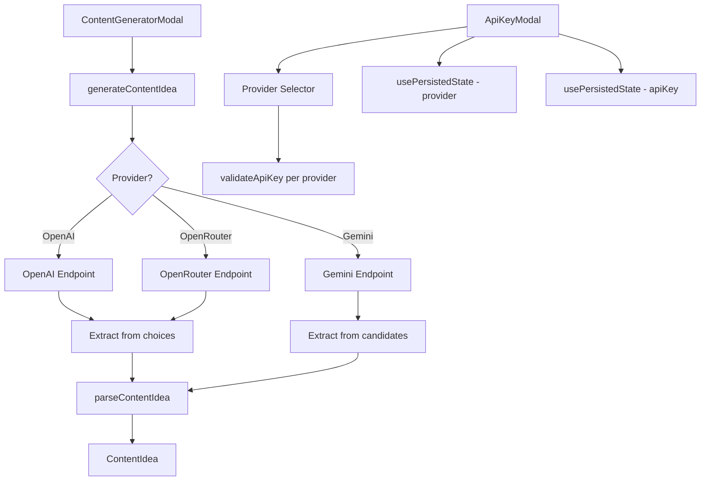

# Design Document: Multi-Provider Support

## Overview

This design extends the existing AI Content Generator in the XaWars RNG app to support multiple AI providers: OpenAI, OpenRouter, and Google Gemini. The current architecture is tightly coupled to OpenAI's API format. This design introduces a provider abstraction layer that routes requests to the correct endpoint, formats request bodies per provider, and normalizes responses into the existing `ContentIdea` structure.

All API calls remain client-side (no backend proxy). The provider choice and API key are persisted in localStorage using the existing `usePersistedState` hook. The design preserves backward compatibility for existing users who already have an OpenAI key stored.

### Key Design Decisions

1. **Configuration-driven provider registry** rather than inheritance/polymorphism — keeps the implementation simple and avoids over-engineering for 3 providers.
2. **Single AI client module** (`app/lib/ai-client.ts`) replaces the current `openai.ts` — centralizes all provider logic in one place.
3. **Shared response format** — all providers produce the same `ContentIdea` object, with provider-specific extraction logic handled internally.
4. **Preserve existing localStorage key** (`xawars_openai_api_key`) for the API key to maintain backward compatibility.

## Architecture



### Data Flow

1. User selects a provider and enters an API key in the `ApiKeyModal`
2. Both values are persisted to localStorage via `usePersistedState`
3. When content generation is triggered, the AI client reads the current provider and key
4. The client constructs a provider-specific request (endpoint, headers, body format)
5. The response is extracted using provider-specific logic (OpenAI/OpenRouter share format; Gemini differs)
6. The extracted JSON string is parsed into a `ContentIdea` using the existing `parseContentIdea` function

## Components and Interfaces

### Provider Configuration Registry

```typescript
// app/lib/ai-providers.ts

export type ProviderId = 'openai' | 'openrouter' | 'gemini';

export interface ProviderConfig {
  id: ProviderId;
  displayName: string;
  keyPlaceholder: string;
  keyHelpUrl: string;
  model: string;
  endpoint: string | ((apiKey: string) => string);
  buildHeaders: (apiKey: string) => Record<string, string>;
  buildRequestBody: (model: string, systemPrompt: string, userMessage: string) => object;
  extractContent: (responseData: unknown) => string;
  validateKey: (key: string) => { valid: boolean; error?: string };
  classifyAuthError: (status: number, body?: unknown) => boolean;
}

export const PROVIDERS: Record<ProviderId, ProviderConfig> = {
  openai: { /* ... */ },
  openrouter: { /* ... */ },
  gemini: { /* ... */ },
};

export const PROVIDER_ORDER: ProviderId[] = ['openai', 'openrouter', 'gemini'];
export const DEFAULT_PROVIDER: ProviderId = 'openai';
```

### AI Client Module

```typescript
// app/lib/ai-client.ts

export { ContentIdea, ApiError, ApiErrorType } from './openai';

export interface GenerateOptions {
  provider: ProviderId;
  apiKey: string;
}

export function validateApiKey(provider: ProviderId, key: string): ApiKeyValidationResult;
export function classifyApiError(provider: ProviderId, error: unknown): ApiError;
export async function generateContentIdea(options: GenerateOptions): Promise<ContentIdea>;
```

### Updated ApiKeyModal Props

```typescript
interface ApiKeyModalProps {
  isOpen: boolean;
  onClose: () => void;
  onSave: (key: string, provider: ProviderId) => void;
  error?: string | null;
  initialProvider?: ProviderId;
}
```

### Updated ContentGeneratorModal Props

```typescript
interface ContentGeneratorModalProps {
  isOpen: boolean;
  onClose: () => void;
  idea: ContentIdea | null;
  isGenerating: boolean;
  error: string | null;
  onGenerate: () => void;
  onClearApiKey: () => void;
  activeProvider: ProviderId;
  onChangeProvider: () => void;
}
```

## Data Models

### Provider Configuration (Static)

| Provider | Endpoint | Model | Key Prefix | Min Length |
|----------|----------|-------|------------|-----------|
| OpenAI | `https://api.openai.com/v1/chat/completions` | `gpt-4o-mini` | `sk-` | 20 |
| OpenRouter | `https://openrouter.ai/api/v1/chat/completions` | `openai/gpt-4o-mini` | `sk-or-` | 20 |
| Gemini | `https://generativelanguage.googleapis.com/v1beta/models/{model}:generateContent?key={apiKey}` | `gemini-2.0-flash` | *(none)* | 10 |

### Request Formats

**OpenAI / OpenRouter (shared format):**
```json
{
  "model": "<model>",
  "max_tokens": 1000,
  "temperature": 0.9,
  "messages": [
    { "role": "system", "content": "<system_prompt>" },
    { "role": "user", "content": "<user_message>" }
  ]
}
```

**OpenRouter additional headers:**
```
Authorization: Bearer <apiKey>
HTTP-Referer: <window.location.origin>
Content-Type: application/json
```

**Gemini:**
```json
{
  "systemInstruction": {
    "parts": [{ "text": "<system_prompt>" }]
  },
  "contents": [
    {
      "role": "user",
      "parts": [{ "text": "<user_message>" }]
    }
  ],
  "generationConfig": {
    "maxOutputTokens": 1000,
    "temperature": 0.9,
    "responseMimeType": "application/json"
  }
}
```

### Response Extraction

**OpenAI / OpenRouter:**
```
response.choices[0].message.content → JSON string
```

**Gemini:**
```
response.candidates[0].content.parts[0].text → JSON string
```

### localStorage Schema

| Key | Value | Default |
|-----|-------|---------|
| `xawars_openai_api_key` | API key string (any provider) | `""` |
| `xawars_ai_provider` | `"openai"` \| `"openrouter"` \| `"gemini"` | `"openai"` |

## Correctness Properties

*A property is a characteristic or behavior that should hold true across all valid executions of a system — essentially, a formal statement about what the system should do. Properties serve as the bridge between human-readable specifications and machine-verifiable correctness guarantees.*

### Property 1: Provider-specific key validation

*For any* provider and *for any* string input, `validateApiKey(provider, input)` SHALL return `valid: true` if and only if the input satisfies that provider's prefix and minimum length rules (OpenAI: starts with "sk-" and length ≥ 20; OpenRouter: starts with "sk-or-" and length ≥ 20; Gemini: length ≥ 10).

**Validates: Requirements 2.1, 2.2, 2.3**

### Property 2: Provider change clears validation state

*For any* current provider selection and *for any* different target provider, switching the provider in the selector SHALL result in the validation error being cleared and the input field being empty.

**Validates: Requirements 2.7**

### Property 3: Persistence round-trip

*For any* valid provider choice and *for any* valid API key string, persisting both values and then reading them back SHALL return the same provider and key. Furthermore, for any sequence of two saves, reading SHALL return the values from the most recent save.

**Validates: Requirements 3.1, 3.2, 3.5**

### Property 4: Request construction invariants

*For any* provider and *for any* valid API key, the constructed request SHALL use the endpoint URL, headers, and model from that provider's configuration. The system prompt and user message content SHALL be identical across all providers. The request SHALL include a 30-second AbortController timeout.

**Validates: Requirements 4.1, 4.2, 4.3, 4.4, 4.5, 4.6, 4.7, 4.8**

### Property 5: Response extraction across formats

*For any* provider and *for any* well-formed API response in that provider's format containing a valid ContentIdea JSON string, the extraction function SHALL produce the same `ContentIdea` object regardless of which provider produced the response.

**Validates: Requirements 5.1, 5.2, 5.3**

### Property 6: ContentIdea parsing round-trip

*For any* valid `ContentIdea` object, serializing it to JSON and then parsing it with `parseContentIdea` SHALL produce an equivalent object. Conversely, *for any* JSON string that is missing required fields or has incorrect array lengths, `parseContentIdea` SHALL throw a parse error.

**Validates: Requirements 5.4, 5.5**

### Property 7: Error classification correctness

*For any* error condition (HTTP 429 response, network TypeError, AbortError timeout), `classifyApiError` SHALL return the correct error type, the expected user-facing message, and `retryable: true`.

**Validates: Requirements 6.4, 6.5, 6.6**

## Error Handling

### Error Classification by Provider

| Condition | OpenAI | OpenRouter | Gemini | Action |
|-----------|--------|------------|--------|--------|
| Auth failure | HTTP 401 | HTTP 401 | HTTP 400 (API key error) | Clear key, open ApiKeyModal with error |
| Rate limit | HTTP 429 | HTTP 429 | HTTP 429 | Show "Too many requests" + retry |
| Network error | TypeError | TypeError | TypeError | Show "Network error" + retry |
| Timeout | AbortError (30s) | AbortError (30s) | AbortError (30s) | Show "Request timed out" + retry |
| Parse error | Invalid JSON | Invalid JSON | Invalid JSON | Show "Failed to parse" + retry |
| Server error | HTTP 5xx | HTTP 5xx | HTTP 5xx | Show "Server error" + retry |

### Gemini Auth Error Detection

Gemini returns HTTP 400 (not 401) for invalid API keys. The error response body contains an error with status `INVALID_ARGUMENT` and a message referencing the API key. The `classifyAuthError` function for Gemini checks for HTTP 400 with this pattern.

### Error Flow

1. `generateContentIdea` throws raw errors (HTTP status objects, TypeErrors, AbortErrors)
2. The calling component catches and passes to `classifyApiError(provider, error)`
3. If `type === 'auth'`: clear stored key, close generator modal, open API key modal with error message
4. If `retryable === true`: show error message with "Try Again" button
5. "Try Again" clears error state and re-invokes `generateContentIdea`

## Testing Strategy

### Property-Based Tests (fast-check, minimum 100 iterations each)

The project already uses `fast-check` (v4.8.0) with `vitest` for property-based testing. Each property test references its design document property.

| Test File | Properties Covered |
|-----------|-------------------|
| `app/lib/__tests__/ai-providers.property.test.ts` | Property 1 (key validation), Property 4 (request construction), Property 5 (response extraction) |
| `app/lib/__tests__/ai-client.property.test.ts` | Property 6 (parsing round-trip), Property 7 (error classification) |
| `app/hooks/__tests__/usePersistedState.property.test.ts` | Property 3 (persistence round-trip — existing, extend) |
| `app/components/__tests__/ApiKeyModal.property.test.tsx` | Property 2 (provider change clears state) |

**Tag format:** `Feature: multi-provider-support, Property {N}: {description}`

### Unit Tests (example-based)

| Test File | Coverage |
|-----------|----------|
| `app/components/__tests__/ApiKeyModal.test.tsx` | Provider selector rendering, default selection, placeholder/link updates, error messages (Req 1, 2) |
| `app/components/__tests__/ContentGeneratorModal.test.tsx` | Provider indicator display, change link behavior (Req 8) |
| `app/lib/__tests__/ai-client.test.ts` | Gemini request format, auth error handling per provider, backward compatibility (Req 6, 7, 9) |

### Integration Tests

| Scenario | Coverage |
|----------|----------|
| Full flow: select provider → enter key → generate → display result | End-to-end with mocked fetch |
| Backward compatibility: legacy localStorage → app loads correctly | Req 9 |
| Auth error flow: 401/400 → clear key → reopen modal | Req 6.1, 6.2, 6.3 |

### Test Configuration

- Property tests: minimum 100 iterations via `fc.assert(property, { numRuns: 100 })`
- All tests run with `vitest --run` (no watch mode)
- Mocked `fetch` for all API tests (no real network calls)
- Mocked `localStorage` for persistence tests in non-browser environments
