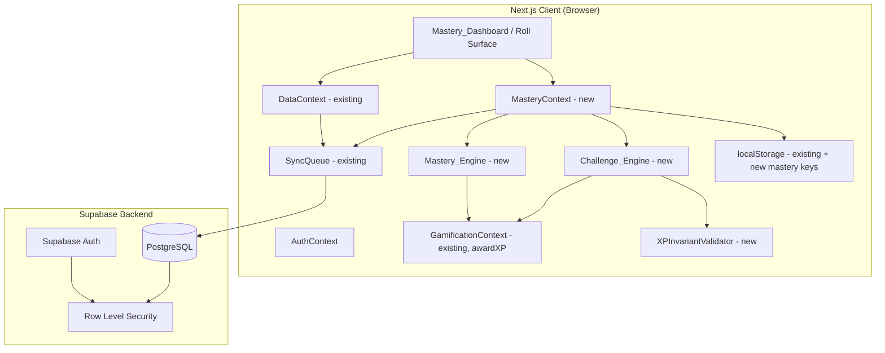
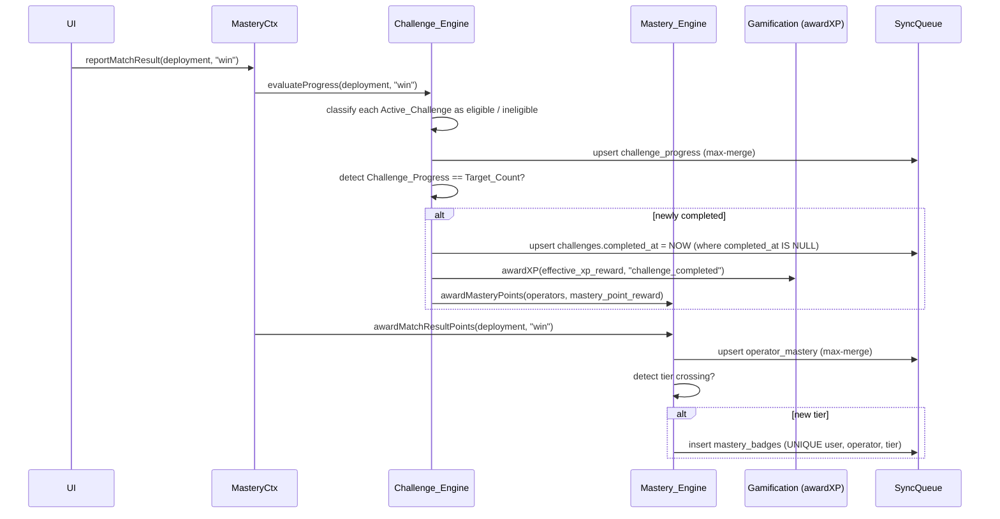
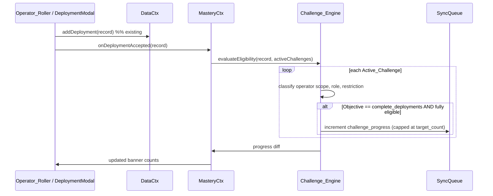
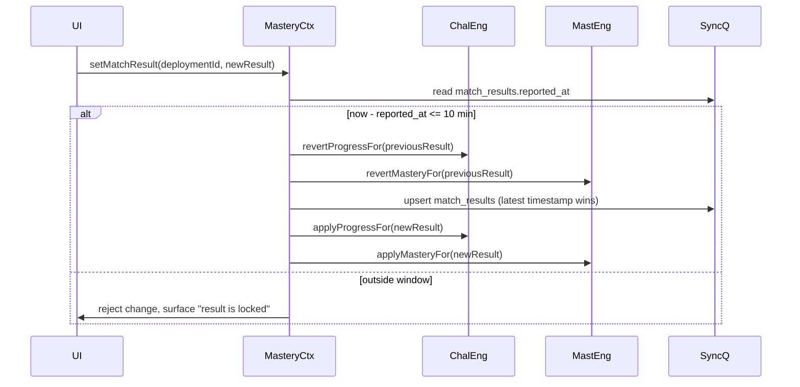
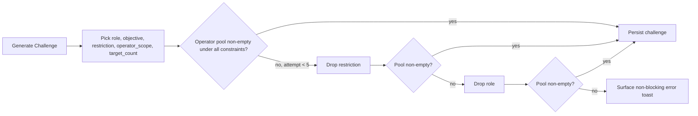

# Design Document: Operator Mastery MVP

## Overview

The Operator Mastery MVP wraps the existing random operator selector in a structured progression loop. It builds on top of the `auth-persistence-gamification` spec (account-level XP/Level via `floor(totalXP / 100) + 1`, daily activity streaks, achievements, Supabase persistence, offline `SyncQueue`, and guest/localStorage fallback) and introduces three coordinated layers:

1. **Challenge_Engine** — generates randomized challenges combining a Role, Objective, Restriction, and Operator_Scope, drives challenge eligibility, and tracks Challenge_Progress.
2. **Mastery_Engine** — awards per-operator Mastery_Points, derives Mastery_Tiers (Bronze / Silver / Gold / Platinum / Diamond), unlocks Mastery_Badges, and tracks the daily-challenge-specific Mastery_Challenge_Streak.
3. **Mastery_Dashboard** — a new top-level UI surface composed of three sections (Active Challenges, Operator Mastery, Mastery Badges) plus a per-operator detail view.

The MVP intentionally **reuses** existing infrastructure rather than duplicating it:
- All XP awards flow through the existing `awardXP(amount, source)` pipeline. The XPSource type is extended with two new values: `challenge_completed` and `mastery_streak_bonus`.
- The existing `daily-activity` streak (used for general app-use streaks) is left untouched. A separate `Mastery_Challenge_Streak` is introduced for daily challenge completion.
- New data lives in five new Supabase tables (`challenges`, `operator_mastery`, `mastery_badges`, `mastery_streak`, `match_results`) plus a single nullable `match_result` column on the existing `deployments` table. No other existing schema is modified.
- The existing `SyncQueue` is reused for offline writes; the existing conflict-resolution policy (latest timestamp wins) is extended with a max-merge policy for monotonically non-decreasing counters (Mastery_Points, Challenge_Progress).

### Key Design Decisions

- **Canonical_XP_Formula as a system invariant.** The formula `xp_reward = target_count × {10 daily, 15 weekly, 12 mission}` applies to every Challenge in the system, including pre-existing rows. On read and on write, deviating Challenges are auto-corrected unless they carry a valid Administrative_Exception (`xp_override` + `xp_override_reason`). Auto-correction is preferred over quarantine so players never see a "stuck" Challenge that cannot award XP.
- **Idempotent reward awarding.** Challenge completion writes a `completed_at` timestamp first; XP and Mastery_Point awards are dispatched only when `completed_at` transitions from null to non-null inside a single transactional update. Sync replays of an already-completed Challenge are a no-op.
- **Match_Result mutability window.** Match_Results are immutable after 10 minutes. Within the window, a change re-evaluates Challenge_Progress and Mastery_Points by replaying the inverse of the previous award and applying the new one, so totals reflect only the final value, not both.
- **Per-operator counters are monotonic.** Mastery_Points only ever increase. Challenge_Progress only ever increases except for kill-revert on a `get_kills` Challenge. This pair of invariants makes max-merge a safe sync-conflict policy.
- **Guest preview is a true preview.** A Guest sees a single locally generated Daily_Challenge with progress tracked in localStorage but no XP, Mastery_Points, or Mastery_Badges are awarded. Sign-up discards the local example and provisions a fresh authenticated Daily and Weekly Challenge.

## Architecture

### Module Layout



`MasteryContext` is the single entry point used by UI components. It composes `Challenge_Engine` and `Mastery_Engine`. Both engines write through the existing `SyncQueue` and read from the local cache before falling back to Supabase. The `XPInvariantValidator` enforces the Canonical_XP_Formula on every Challenge read or write.

### Reward Pipeline

Every reward path collapses into the same idempotent shape:



The `completed_at IS NULL` precondition on the completion update is the idempotency anchor: a sync replay of a completion finds `completed_at` already set, the conditional `UPDATE` affects 0 rows, and `awardXP` is not called. The same pattern protects Mastery_Streak_Bonus awards (one badge row per `(streak_length, run_id)`) and Mastery_Badge unlocks (`UNIQUE (user_id, operator_id, tier)`).

### Data Flow on Deployment Acceptance



### Match_Result Mutability Window



Within the window, the only counters that can decrement during a re-evaluation are scoped to the specific Match_Result transition; Mastery_Points are not directly decremented — instead the engine recomputes the **expected** total contribution of this single deployment and writes the difference. The "Mastery_Points only ever increase" invariant holds **across the lifecycle of the user account**: within the mutability window, a temporary undo is part of the same logical event, and the visible total never goes backwards from the user's perspective because the previous award and the revert are batched into a single transaction.

### Constraint-Relaxation Retry for Generation



### Layered Persistence

| Layer | Authenticated User | Guest |
|---|---|---|
| Active Challenges | Supabase `challenges` (RLS-scoped) | localStorage `xawars_mastery_guest_challenge` (preview only) |
| Operator Mastery | Supabase `operator_mastery` | not persisted (no awards in guest mode) |
| Mastery Badges | Supabase `mastery_badges` | not persisted |
| Mastery Streak | Supabase `mastery_streak` | not persisted |
| Match Results | Supabase `match_results` + `deployments.match_result` | localStorage progress only, no XP/Mastery |
| Sync | existing `SyncQueue` (max-merge for monotonic counters, latest-timestamp for Match_Result) | n/a |

## Components and Interfaces

### MasteryContext

`MasteryContext` is the single React context exposed to UI. It composes the engines, holds the in-memory cache, and orchestrates writes through the `SyncQueue`.

```typescript
// app/context/MasteryContext.tsx
interface MasteryContextValue {
  // Active state
  dailyChallenge: Challenge | null;
  weeklyChallenge: Challenge | null;
  activeOperatorMissions: Challenge[];          // length 0..3
  availableOperatorMissions: (operatorId: string) => Challenge[]; // up to 3 per operator
  operatorMastery: Record<string, OperatorMastery>;
  masteryBadges: MasteryBadge[];
  masteryStreak: MasteryStreakState;

  // Lifecycle hooks (called by existing roll/deployment flow)
  onDeploymentAccepted: (deployment: DeploymentRecord) => Promise<void>;
  onKillIncremented: (deploymentId: string, operatorId: string, delta: 1 | -1) => Promise<void>;
  reportMatchResult: (deploymentId: string, result: MatchResult) => Promise<MatchResultReportOutcome>;

  // User actions
  activateOperatorMission: (challengeId: string) => Promise<ActivateResult>;
  discardChallenge: (challengeId: string) => Promise<void>;
  refreshChallenges: () => Promise<void>;       // called on app open + slot boundaries
}

type MatchResult = 'win' | 'loss' | 'survived_round';

interface MatchResultReportOutcome {
  applied: boolean;
  reason?: 'outside_mutability_window' | 'no_change' | 'persistence_failure';
}

interface ActivateResult {
  activated: boolean;
  reason?: 'mission_limit_reached' | 'already_active';
}
```

### Challenge_Engine

```typescript
// app/lib/mastery/challenge-engine.ts
interface ChallengeEngine {
  generateDaily: (userId: string, today: Date) => Challenge;
  generateWeekly: (userId: string, weekStart: Date) => Challenge;
  generateOperatorMissions: (userId: string, operatorId: string) => Challenge[]; // up to 3

  evaluateEligibility: (
    deployment: DeploymentRecord,
    challenge: Challenge
  ) => Eligibility;

  applyDeploymentProgress: (
    deployment: DeploymentRecord,
    challenge: Challenge
  ) => Challenge;

  applyMatchResultProgress: (
    deployment: DeploymentRecord,
    result: MatchResult,
    challenge: Challenge
  ) => Challenge;

  applyKillIncrement: (
    deployment: DeploymentRecord,
    operatorId: string,
    delta: 1 | -1,
    challenge: Challenge
  ) => Challenge;

  isCompleted: (challenge: Challenge) => boolean;
  computeEffectiveXpReward: (challenge: Challenge) => number;
}

interface Eligibility {
  operatorScopeOk: boolean;
  roleOk: boolean;
  restrictionOk: boolean;
  fullyEligible: boolean;     // operatorScopeOk && roleOk && restrictionOk
}
```

The Challenge_Engine is **pure** with respect to state: every `apply*` function takes the current Challenge and returns the next Challenge. Persistence is the caller's responsibility (always via SyncQueue). This makes the engine cheap to unit-test and property-test.

### Mastery_Engine

```typescript
// app/lib/mastery/mastery-engine.ts
interface MasteryEngine {
  pointsFor: (event: MasteryEvent) => number;     // 10 win, 5 survive, 15 kill_target, N challenge
  applyAward: (
    state: OperatorMastery,
    points: number
  ) => { next: OperatorMastery; tierCrossed: MasteryTier | null };

  computeTier: (points: number) => MasteryTier;
  pointsToNextTier: (points: number) => number;

  applyStreakIncrement: (state: MasteryStreakState, today: Date) => StreakDelta;
  applyStreakReset: (state: MasteryStreakState) => MasteryStreakState;
}

type MasteryEvent =
  | { kind: 'match_result_win' }
  | { kind: 'match_result_survived' }
  | { kind: 'kill_target_complete' }
  | { kind: 'challenge_completed'; reward: number };

interface StreakDelta {
  next: MasteryStreakState;
  bonusEarned: { length: 3 | 7 | 30; xp: 50 | 150 | 750 } | null;
}
```

### XPInvariantValidator

```typescript
// app/lib/mastery/xp-invariant.ts
const CANONICAL_MULTIPLIERS = { daily: 10, weekly: 15, mission: 12 } as const;

function canonicalXpReward(slot: ChallengeSlot, targetCount: number): number {
  return targetCount * CANONICAL_MULTIPLIERS[slot];
}

interface XpValidationOutcome {
  effectiveXpReward: number;          // value to award when challenge completes
  needsAutoCorrection: boolean;        // true if persisted xp_reward != canonical and no admin exception
  needsOrphanFix: boolean;             // true if exactly one of xp_override / xp_override_reason is non-null
  isAdministrativeException: boolean;  // both fields valid and present
  correctedRow: ChallengeRow;          // row to persist when needsAutoCorrection or needsOrphanFix
}

function validateXp(challenge: ChallengeRow): XpValidationOutcome;

// Validation rules for an admin/migration write attempt
function validateAdminOverride(
  next: { xp_override: number | null; xp_override_reason: string | null }
): { ok: true } | { ok: false; reason: AdminOverrideRejection };

type AdminOverrideRejection =
  | 'orphan_override'
  | 'orphan_reason'
  | 'override_out_of_range'   // not integer, or < 0, or > 10000
  | 'reason_too_short'         // < 1 non-whitespace char
  | 'reason_too_long';         // > 500 non-whitespace chars
```

The validator runs in three places:
1. On Challenge generation — refuses to set `xp_override` from the generation flow (logs and rejects).
2. On Challenge read — auto-corrects deviating rows, persists the correction, and only then exposes the Challenge to the UI.
3. Just before XP is awarded on completion — uses `effectiveXpReward` (the override when it's a valid Administrative_Exception, otherwise the canonical value).

If persistence of an auto-correction fails, `awardXP` is **not** called and the Mastery_System surfaces a non-blocking "reward temporarily unavailable" error.

### Mastery_Dashboard

```typescript
// app/components/mastery/MasteryDashboard.tsx
function MasteryDashboard(): JSX.Element;
// Three sections:
//   <ActiveChallengesSection /> — daily, weekly, active missions, time-remaining
//   <OperatorMasterySection /> — sorted by points desc, tier badge, next-tier delta
//   <MasteryBadgesSection />  — grouped by operator, tier, unlock timestamp

// app/components/mastery/OperatorMasteryDetail.tsx
function OperatorMasteryDetail({ operatorId }: { operatorId: string }): JSX.Element;
// Sections: points history, available missions (max 3), unlocked badges for this operator

// app/components/mastery/ChallengeBanner.tsx
function ChallengeBanner({ challenge, slot }: ChallengeBannerProps): JSX.Element;
// Used by the Operator_Roller surface; shows title, role, objective, restriction, target/progress, time-remaining

// app/components/mastery/MatchResultControl.tsx
function MatchResultControl({ deploymentId }: { deploymentId: string }): JSX.Element;
// Three buttons: Win / Loss / Survived Round; surfaces "Change result (Xm left)" within the 10-min window
```

### Integration with Existing Components

| Existing component | Change |
|---|---|
| `app/page.tsx` (`handleAccept`) | After `addDeployment(...)`, call `mastery.onDeploymentAccepted(record)`. |
| `OperatorStatsModal` (kill increment) | After incrementing per-operator kills, call `mastery.onKillIncremented(deploymentId, operatorId, +1)`. The same path with `-1` runs on revert. |
| Active deployment surface | Render `<MatchResultControl />` when `match_result` is null or within the 10-minute window. |
| Roll surface | Render `<ChallengeBanner slot="daily" />`, `<ChallengeBanner slot="weekly" />`, and a collapsed missions indicator when at least one is active. |
| Main hub navigation | Add a `Mastery` entry that routes to `<MasteryDashboard />`. |

### XPSource Extension

The existing `XPSource` type (defined in `auth-persistence-gamification` design) is extended:

```typescript
type XPSource =
  | 'deployment'             // existing
  | 'kill_target'            // existing
  | 'content_idea'           // existing
  | 'ranked_win'             // existing
  | 'challenge_completed'    // new
  | 'mastery_streak_bonus';  // new
```

No parallel XP store is introduced. The Mastery_System only ever calls `awardXP(amount, source)`.

## Data Models

### Supabase Schema

#### `challenges` (new)

```sql
CREATE TABLE public.challenges (
  id UUID PRIMARY KEY DEFAULT gen_random_uuid(),
  user_id UUID NOT NULL REFERENCES public.profiles(id) ON DELETE CASCADE,
  slot TEXT NOT NULL CHECK (slot IN ('daily', 'weekly', 'mission')),
  role TEXT,                                     -- nullable, role-agnostic if null
  objective TEXT NOT NULL CHECK (objective IN (
    'complete_deployments', 'win_rounds', 'survive_rounds', 'get_kills'
  )),
  target_count INTEGER NOT NULL CHECK (target_count BETWEEN 1 AND 50),
  restriction_kind TEXT CHECK (restriction_kind IN (
    'gadget_only', 'playstyle', 'loadout_limit'
  )),
  restriction_value TEXT,                        -- e.g. "Smoke Grenade", "R4-C", role string
  operator_scope TEXT NOT NULL CHECK (operator_scope IN (
    'any', 'random_pool', 'specific_operator'
  )),
  operator_pool JSONB NOT NULL DEFAULT '[]'::jsonb, -- string[] of operator ids; length 1..5 for random_pool, length 1 for specific_operator
  xp_reward INTEGER NOT NULL CHECK (xp_reward >= 0),
  mastery_point_reward INTEGER NOT NULL CHECK (mastery_point_reward >= 0),
  xp_override INTEGER CHECK (xp_override IS NULL OR (xp_override BETWEEN 0 AND 10000)),
  xp_override_reason TEXT,
  progress INTEGER NOT NULL DEFAULT 0 CHECK (progress >= 0),
  generated_at TIMESTAMPTZ NOT NULL DEFAULT NOW(),
  expires_at TIMESTAMPTZ,                        -- null for missions; refresh boundary for daily/weekly
  completed_at TIMESTAMPTZ,                      -- non-null = Completed_Challenge
  discarded_at TIMESTAMPTZ,
  updated_at TIMESTAMPTZ NOT NULL DEFAULT NOW(),

  -- Both override fields together, or both null
  CHECK (
    (xp_override IS NULL AND xp_override_reason IS NULL)
    OR (xp_override IS NOT NULL AND xp_override_reason IS NOT NULL)
  ),
  -- progress can never exceed target
  CHECK (progress <= target_count)
);

CREATE INDEX idx_challenges_user_active
  ON public.challenges (user_id, slot)
  WHERE completed_at IS NULL AND discarded_at IS NULL;

ALTER TABLE public.challenges ENABLE ROW LEVEL SECURITY;
CREATE POLICY "challenges_owner" ON public.challenges
  USING (auth.uid() = user_id) WITH CHECK (auth.uid() = user_id);
```

#### `operator_mastery` (new)

```sql
CREATE TABLE public.operator_mastery (
  id UUID PRIMARY KEY DEFAULT gen_random_uuid(),
  user_id UUID NOT NULL REFERENCES public.profiles(id) ON DELETE CASCADE,
  operator_id TEXT NOT NULL,
  mastery_points INTEGER NOT NULL DEFAULT 0 CHECK (mastery_points >= 0),
  current_tier TEXT NOT NULL DEFAULT 'Bronze'
    CHECK (current_tier IN ('Bronze','Silver','Gold','Platinum','Diamond')),
  updated_at TIMESTAMPTZ NOT NULL DEFAULT NOW(),
  UNIQUE (user_id, operator_id)
);

ALTER TABLE public.operator_mastery ENABLE ROW LEVEL SECURITY;
CREATE POLICY "operator_mastery_owner" ON public.operator_mastery
  USING (auth.uid() = user_id) WITH CHECK (auth.uid() = user_id);
```

#### `mastery_badges` (new)

```sql
CREATE TABLE public.mastery_badges (
  id UUID PRIMARY KEY DEFAULT gen_random_uuid(),
  user_id UUID NOT NULL REFERENCES public.profiles(id) ON DELETE CASCADE,
  operator_id TEXT NOT NULL,
  tier TEXT NOT NULL CHECK (tier IN ('Bronze','Silver','Gold','Platinum','Diamond')),
  unlocked_at TIMESTAMPTZ NOT NULL DEFAULT NOW(),
  UNIQUE (user_id, operator_id, tier)
);

ALTER TABLE public.mastery_badges ENABLE ROW LEVEL SECURITY;
CREATE POLICY "mastery_badges_owner" ON public.mastery_badges
  USING (auth.uid() = user_id) WITH CHECK (auth.uid() = user_id);
```

The `UNIQUE (user_id, operator_id, tier)` constraint is the structural enforcement of the badge-uniqueness invariant: a sync replay of a tier-cross event raises `23505` on insert and is treated as success by the existing `SyncQueue` conflict handler.

#### `mastery_streak` (new)

```sql
CREATE TABLE public.mastery_streak (
  user_id UUID PRIMARY KEY REFERENCES public.profiles(id) ON DELETE CASCADE,
  current_streak INTEGER NOT NULL DEFAULT 0 CHECK (current_streak >= 0),
  longest_streak INTEGER NOT NULL DEFAULT 0 CHECK (longest_streak >= 0),
  last_completed_date DATE,
  run_id UUID NOT NULL DEFAULT gen_random_uuid(), -- changes on every reset
  bonuses_awarded_in_run JSONB NOT NULL DEFAULT '[]'::jsonb, -- subset of [3, 7, 30]
  updated_at TIMESTAMPTZ NOT NULL DEFAULT NOW()
);

ALTER TABLE public.mastery_streak ENABLE ROW LEVEL SECURITY;
CREATE POLICY "mastery_streak_owner" ON public.mastery_streak
  USING (auth.uid() = user_id) WITH CHECK (auth.uid() = user_id);
```

`run_id` is regenerated every time the streak resets to zero. The `bonuses_awarded_in_run` array makes the 3 / 7 / 30 bonus awards idempotent across sync replays: a replay finds the bonus length already in the array and skips the `awardXP` call.

#### `match_results` (new)

```sql
CREATE TABLE public.match_results (
  deployment_id UUID PRIMARY KEY REFERENCES public.deployments(id) ON DELETE CASCADE,
  user_id UUID NOT NULL REFERENCES public.profiles(id) ON DELETE CASCADE,
  result TEXT NOT NULL CHECK (result IN ('win','loss','survived_round')),
  reported_at TIMESTAMPTZ NOT NULL DEFAULT NOW(),
  updated_at TIMESTAMPTZ NOT NULL DEFAULT NOW()
);

ALTER TABLE public.match_results ENABLE ROW LEVEL SECURITY;
CREATE POLICY "match_results_owner" ON public.match_results
  USING (auth.uid() = user_id) WITH CHECK (auth.uid() = user_id);
```

The 10-minute mutability window is computed from `reported_at`. `updated_at` advances on every change inside the window; once the window closes, the application layer rejects further edits. The existing `SyncQueue` latest-timestamp policy resolves cross-device race conflicts on `updated_at`.

#### `deployments` (existing; one nullable column added)

```sql
ALTER TABLE public.deployments
  ADD COLUMN match_result TEXT
  CHECK (match_result IS NULL OR match_result IN ('win','loss','survived_round'));
```

`deployments.match_result` is a denormalized convenience column that lets the deployment list render the result chip without joining `match_results`. The source of truth for mutability and timestamps is `match_results`. The two are kept consistent inside `MasteryContext.reportMatchResult`.

No other existing schema (`gamification`, `achievements`, `operator_stats`, `ranked_stats`, `content_ideas`) is modified.

### TypeScript Types

```typescript
// app/types/mastery.ts
export type ChallengeSlot = 'daily' | 'weekly' | 'mission';
export type Objective =
  | 'complete_deployments'
  | 'win_rounds'
  | 'survive_rounds'
  | 'get_kills';
export type RestrictionKind = 'gadget_only' | 'playstyle' | 'loadout_limit';
export type OperatorScope = 'any' | 'random_pool' | 'specific_operator';
export type MasteryTier = 'Bronze' | 'Silver' | 'Gold' | 'Platinum' | 'Diamond';
export type MatchResult = 'win' | 'loss' | 'survived_round';

export interface Restriction {
  kind: RestrictionKind;
  value: string; // gadget name | role string | weapon name
}

export interface Challenge {
  id: string;
  userId: string;
  slot: ChallengeSlot;
  role: string | null;
  objective: Objective;
  targetCount: number;          // 1..50
  restriction: Restriction | null;
  operatorScope: OperatorScope;
  operatorPool: string[];        // [] for 'any', 1..5 for 'random_pool', length 1 for 'specific_operator'
  xpReward: number;              // canonical or override
  masteryPointReward: number;
  xpOverride: number | null;
  xpOverrideReason: string | null;
  progress: number;              // 0..targetCount
  generatedAt: string;
  expiresAt: string | null;      // null for mission
  completedAt: string | null;
  discardedAt: string | null;
}

export interface OperatorMastery {
  userId: string;
  operatorId: string;
  masteryPoints: number;
  currentTier: MasteryTier;
}

export interface MasteryBadge {
  id: string;
  userId: string;
  operatorId: string;
  tier: MasteryTier;
  unlockedAt: string;
}

export interface MasteryStreakState {
  userId: string;
  currentStreak: number;
  longestStreak: number;
  lastCompletedDate: string | null;
  runId: string;
  bonusesAwardedInRun: Array<3 | 7 | 30>;
}

export interface MatchResultRow {
  deploymentId: string;
  userId: string;
  result: MatchResult;
  reportedAt: string;
  updatedAt: string;
}
```

### Tier Threshold Table

| Tier | Range (points) | Points to next tier from floor |
|---|---|---|
| Bronze | [0, 100) | 100 |
| Silver | [100, 300) | 200 |
| Gold | [300, 600) | 300 |
| Platinum | [600, 1000) | 400 |
| Diamond | [1000, ∞) | n/a |

### Reward Table

| Trigger | Account XP source | Per-operator Mastery_Points |
|---|---|---|
| Match_Result `win` reported | none (XP comes from challenges) | +10 to deployment's operator |
| Match_Result `survived_round` reported | none | +5 to deployment's operator |
| Kill target completed for operator | `kill_target` (existing, unchanged) | +15 to that operator |
| Daily_Challenge completed | `challenge_completed` (= `target × 10`) | `target × 5` to each operator that contributed |
| Weekly_Challenge completed | `challenge_completed` (= `target × 15`) | `target × 5` to each operator that contributed |
| Operator_Mission completed | `challenge_completed` (= `target × 12`) | `target × 5` to the mission's specific operator |
| Mastery_Challenge_Streak hits 3 / 7 / 30 | `mastery_streak_bonus` (50 / 150 / 750) | none |


## Correctness Properties

*A property is a characteristic or behavior that should hold true across all valid executions of a system — essentially, a formal statement about what the system should do. Properties serve as the bridge between human-readable specifications and machine-verifiable correctness guarantees.*

### Property 1: Canonical XP Formula invariant

*For any* Challenge `C` persisted in the Mastery_System whose `xp_override` is null, after the Mastery_System has read or generated `C`, the invariant `C.xp_reward == canonical_xp_formula(C.slot, C.target_count)` holds, where `canonical_xp_formula(slot, target_count) = target_count × {10 daily, 15 weekly, 12 mission}`. *For any* Challenge `C` whose `xp_override` and `xp_override_reason` are both non-null and pass the admin-override validation rules (`xp_override` is an integer in `[0, 10000]`, `xp_override_reason` has 1..500 non-whitespace characters), the effective XP awarded on completion equals `xp_override` and `xp_reward` is not auto-corrected. *For any* attempted admin or migration write that fails any override validation rule (orphan field, override out of range, reason length out of range), the persisted `xp_override` and `xp_override_reason` fields are unchanged.

**Validates: Requirements 1.5, 6.6, 16.1, 16.2, 16.3, 16.4, 16.5, 16.6, 16.7, 16.8, 16.10**

### Property 2: Generated Challenge well-formedness

*For any* user, current local date, and slot, a Challenge generated by the Challenge_Engine satisfies: `slot` ∈ {daily, weekly, mission}; `target_count` ∈ `[1, 10]` for daily, `[5, 50]` for weekly, `[1, 50]` for mission; `objective` is one of the four valid objectives; `operator_scope` is one of the three valid scopes; `mastery_point_reward == target_count × 5`; `xp_override` and `xp_override_reason` are both null; and all required persisted fields (id, slot, role, objective, target_count, restriction, operator_scope, operator_pool, xp_reward, mastery_point_reward, generated_at, progress) are present.

**Validates: Requirements 1.1, 1.2, 1.6, 1.8**

### Property 3: Random pool sizing and operator validity

*For any* generated Challenge with `operator_scope == 'random_pool'`, `|operator_pool|` is in `[1, 5]` and every id in `operator_pool` exists in the operator catalog. *For any* generated Challenge with `operator_scope == 'specific_operator'`, `|operator_pool|` equals 1 and the id exists in the operator catalog. *For any* generated Challenge with `operator_scope == 'any'`, `operator_pool` is empty.

**Validates: Requirements 1.3**

### Property 4: Gadget restriction respects every operator in the pool

*For any* generated Challenge with `restriction.kind == 'gadget_only'`, `restriction.value` appears in the `gadgets` list of every operator in `operator_pool` (or, when `operator_scope == 'any'`, in the gadgets list of every operator in the operator catalog).

**Validates: Requirements 1.4**

### Property 5: Constraint-relaxation retry produces a valid Challenge or surfaces an error

*For any* initial constraint set (slot, role, objective, restriction kind, operator scope) provided to the Challenge_Engine, the engine performs at most 5 retry attempts, where each retry first drops the restriction and then drops the role, and produces either (a) a Challenge whose `operator_pool` is non-empty under all remaining constraints, or (b) no Challenge accompanied by a single non-blocking error toast.

**Validates: Requirements 1.7**

### Property 6: Eligibility classification correctness

*For any* Deployment `D` and Active_Challenge `C`, the Challenge_Engine classifies `D` as fully eligible for `C` if and only if all three of the following hold: (i) `C.operator_scope == 'any'` OR (`C.operator_scope == 'random_pool'` AND `D.operatorId ∈ C.operator_pool`) OR (`C.operator_scope == 'specific_operator'` AND `D.operatorId == C.operator_pool[0]`); (ii) `C.role` is null OR `D.role == C.role`; (iii) `C.restriction` is null OR (`C.restriction.kind == 'gadget_only'` AND `D.loadout.gadget == C.restriction.value`) OR (`C.restriction.kind == 'loadout_limit'` AND (`D.loadout.primary == C.restriction.value` OR `D.loadout.secondary == C.restriction.value`)) OR (`C.restriction.kind == 'playstyle'` AND `D.role == C.restriction.value`).

**Validates: Requirements 3.1, 3.2, 3.3, 3.4, 3.5, 3.6, 3.7, 3.8**

### Property 7: Challenge_Progress evolution

*For any* sequence of progress events `E[0..n]` applied to a Challenge `C` (where each event is a deployment-acceptance, match-result-report, kill-increment, or kill-revert), and *for any* event index `i`: (i) `0 <= C.progress[i] <= C.target_count`; (ii) when `E[i]` is an event matching `C.objective` and is fully eligible, `C.progress[i+1] == min(C.target_count, C.progress[i] + 1)`; (iii) when `E[i]` is a kill-revert on a Challenge with `C.objective == 'get_kills'` whose previous kill increment had been counted, `C.progress[i+1] == max(0, C.progress[i] - 1)`; (iv) for all other events, `C.progress[i+1] == C.progress[i]`.

**Validates: Requirements 4.1, 4.2, 4.3, 4.4, 4.5, 4.6**

### Property 8: Challenge completion is idempotent

*For any* event trace that includes one or more completion events for a Challenge `C` (defined as the moment `C.progress` first reaches `C.target_count`, plus any number of duplicate completion-replay events from sync), the Mastery_System sets `C.completed_at` exactly once (at the first such event) and dispatches exactly one `awardXP(effectiveXpReward, 'challenge_completed')` call and exactly one `awardMasteryPoints(operatorContributors, masteryPointReward)` call for `C.id`.

**Validates: Requirements 5.1, 5.2, 5.3, 5.5**

### Property 9: Operator_Mission active count invariant

*For any* sequence of activate-mission and discard-mission events for a user, the count of active Operator_Missions stays within `[0, 3]` at every point in time, an `activateOperatorMission` call returns `{activated: true}` if and only if the prior count is strictly less than 3 and the mission is not already active, and any discarded mission can be re-activated later.

**Validates: Requirements 6.2, 6.3, 6.4, 6.5**

### Property 10: Mastery_Points trace sum

*For any* event trace `E[0..n]` and *for any* operator id `o`, the Mastery_Engine's persisted `mastery_points[o]` after the trace equals the sum over all `i` of: `10` if `E[i]` is a Match_Result `win` reported on a Deployment with operator `o`; `5` if `E[i]` is a Match_Result `survived_round` on `o`; `15` if `E[i]` is a kill-target completion for `o`; the `mastery_point_reward` of any Challenge `C` completed by `E[i]` whose contributing operator set contains `o`; and `0` otherwise.

**Validates: Requirements 7.1, 7.2, 7.3, 5.3**

### Property 11: Mastery_Points are monotonic under sync replay

*For any* event trace possibly containing duplicate award events (sync replays), and *for any* operator id `o` and any pair of trace prefixes `T_a ⊆ T_b`, `mastery_points[o]` after `T_a` is less than or equal to `mastery_points[o]` after `T_b`, and the final `mastery_points[o]` value is independent of duplicates (each unique award contributes once).

**Validates: Requirements 7.5, 12.4**

### Property 12: Mastery_Tier threshold table

*For any* non-negative integer `points`, `computeTier(points)` equals `Bronze` when `points ∈ [0, 100)`, `Silver` when `points ∈ [100, 300)`, `Gold` when `points ∈ [300, 600)`, `Platinum` when `points ∈ [600, 1000)`, and `Diamond` when `points >= 1000`.

**Validates: Requirements 7.4, 14.4**

### Property 13: Mastery_Badge uniqueness per (user, operator, tier)

*For any* event trace possibly containing duplicate tier-crossing events (sync replays for the same user, operator, and tier), the count of `mastery_badges` rows with that `(user_id, operator_id, tier)` triple is exactly 1.

**Validates: Requirements 8.1, 8.5**

### Property 14: Mastery_Challenge_Streak length and bonus idempotency

*For any* sequence of daily-challenge-completion events with calendar dates, after applying the sequence: `current_streak` equals the length of the longest consecutive-calendar-day run ending at the most recent completion, or `0` if the most recent completion is not yesterday or today; `longest_streak` is the maximum value `current_streak` ever held during the sequence; and *for any* bonus length `L ∈ {3, 7, 30}` and *for any* run identified by `run_id`, the `mastery_streak_bonus` XP for `L` is awarded at most once per `run_id` even when the streak hits `L` multiple times across replays.

**Validates: Requirements 9.1, 9.2, 9.3**

### Property 15: Match_Result mutability window re-evaluation correctness

*For any* sequence of Match_Result events for a single Deployment that includes an initial report at time `t0` and zero or more change events at times `t1 < t2 < ...`, where `R_final` is the most recent reported result whose corresponding event time `t_k` satisfies `t_k - t0 <= 10 minutes`, and where any change event with `t_j - t0 > 10 minutes` is rejected (state unchanged): the resulting Challenge_Progress diff and Mastery_Points diff for that Deployment equal the diff that would have been produced by reporting only `R_final` once, never the sum of any prior in-window result and `R_final`.

**Validates: Requirements 11.4, 11.5, 12.5**

### Property 16: Sync conflict max-merge for monotonic counters

*For any* pair `(local, remote)` of non-negative integer values for a monotonic counter (`mastery_points` or `challenge_progress`), the SyncQueue conflict resolution returns `max(local, remote)`.

**Validates: Requirements 12.4**

### Property 17: Sync conflict latest-timestamp for Match_Result

*For any* pair `(local, remote)` of `MatchResultRow` rows for the same `deployment_id`, the SyncQueue conflict resolution returns the row with the larger `updated_at` timestamp; on tie, the local row wins (consistent with the existing optimistic-local-first policy).

**Validates: Requirements 12.5**

### Property 18: Guest mode never awards XP or Mastery_Points

*For any* event trace executed while no authenticated session exists, the call counts of `awardXP` and `awardMasteryPoints` are both 0, no `mastery_badges` rows are created, no `operator_mastery` rows are created, and no `mastery_streak` state is mutated.

**Validates: Requirements 13.2, 13.3**

### Property 19: Sign-up discards guest preview state

*For any* guest local state (a single example Daily_Challenge with progress) and *for any* sign-up or first-login transition, after the transition the localStorage key for the guest example Challenge is removed and the authenticated user's `challenges` table contains exactly one fresh Daily_Challenge and one fresh Weekly_Challenge with `progress == 0`.

**Validates: Requirements 13.4**

### Property 20: No rewards for non-gameplay events

*For any* event trace consisting solely of non-gameplay events (open Mastery_Dashboard, scroll, reload page, navigate between sections), the call counts of `awardXP`, `awardMasteryPoints`, and `unlockMasteryBadge` are all 0, and no `challenges.progress` field changes value.

**Validates: Requirements 14.1, 14.2**

### Property 21: Roll-surface Challenge banner render content

*For any* Active Daily_Challenge or Weekly_Challenge `C`, the rendered `<ChallengeBanner />` contains: the slot label, `C` title or objective text, `C.role` (when non-null), `C.restriction` description (when non-null), the string `${C.progress}/${C.target_count}`, and a time-remaining string for daily and weekly slots.

**Validates: Requirements 2.1, 2.2, 2.3**

### Property 22: Mastery_Dashboard render content

*For any* mastery state with operators `O = {(operatorId, masteryPoints, tier)}` and badges `B = {(operatorId, tier, unlockedAt)}`, the rendered `<MasteryDashboard />` contains: an Active Challenges section listing the daily, weekly, and active operator missions; an Operator Mastery section listing every operator in `O` (sorted by `masteryPoints` descending) with operator name, current tier, current points, and points-to-next-tier; and a Mastery Badges section listing every badge in `B` grouped by operator with tier and unlock timestamp.

**Validates: Requirements 7.7, 8.4, 10.1, 10.2, 10.3, 10.4**

## Error Handling

### Challenge Generation Errors

| Error | User-facing behavior | Recovery |
|---|---|---|
| All 5 retry attempts fail to find a non-empty operator pool | Non-blocking toast: "Couldn't roll a new challenge — try again in a few minutes." | Background retry on next app open or slot refresh |
| Generation succeeds but `xp_override`/`xp_override_reason` were illegally set by the generation flow | Generation rejected, attempt logged to console with `[XAWARS]` prefix, fresh generation re-attempted with override fields forced to null | Self-healing |

### XP Invariant Errors

| Error | User-facing behavior | Recovery |
|---|---|---|
| Persisted Challenge deviates from Canonical_XP_Formula and is not an Administrative_Exception | Auto-correct on read; correction is persisted before the Challenge becomes eligible for XP | Self-healing |
| Persisting an auto-correction fails | Non-blocking error: "Reward temporarily unavailable for this challenge — retrying." `awardXP` is **not** called. | SyncQueue retries; `awardXP` only fires after persistence succeeds |
| Admin/migration tries to set an orphan or out-of-range override | Change rejected, persisted state unchanged, rejection logged | Reject |

### Match_Result Reporting Errors

| Error | User-facing behavior | Recovery |
|---|---|---|
| User attempts to change Match_Result outside the 10-minute window | Toast: "This result is now locked." Original result is preserved. | None (by design) |
| Match_Result write fails to persist | Optimistic local update remains; SyncQueue retries; conflict resolved by latest-timestamp | Eventually consistent |
| Match_Result conflict between devices within the window | Latest-timestamp policy applied; the device with the older timestamp visibly updates to the winner's value on next sync | Self-healing |

### Reward Award Errors

| Error | User-facing behavior | Recovery |
|---|---|---|
| `awardXP` invoked but Gamification_Engine fails to persist | Existing `auth-persistence-gamification` retry behavior applies (optimistic local + SyncQueue) | Eventually consistent |
| Mastery_Badge insert fails with unique constraint (replay) | Treated as success by SyncQueue conflict handler | Self-healing |
| Streak bonus would be awarded twice for the same `(run_id, length)` | Skipped because `bonuses_awarded_in_run` already contains the length | Self-healing |

### Persistence and Sync Errors

| Error | User-facing behavior | Recovery |
|---|---|---|
| Offline | Local cache continues to serve reads; writes accumulate in SyncQueue | Drained on reconnect |
| Monotonic-counter sync conflict | Max-merge applied silently | None needed |
| Match_Result sync conflict | Latest-timestamp applied silently | None needed |

### Guest Mode Errors

| Error | User-facing behavior | Recovery |
|---|---|---|
| Guest attempts to open Mastery_Dashboard, Weekly_Challenge, Operator_Mission, or any badge view | Login prompt explaining that progression requires an account | Sign in |
| Guest local example Challenge data is corrupted in localStorage | Discard and regenerate example; logged | Self-healing |

## Testing Strategy

### Test Categories

**Property tests (fast-check, ≥ 100 iterations).** The 22 correctness properties above each map to a single property-based test using the existing `fast-check` v4.x and `vitest` setup. Test files live under `app/lib/mastery/__tests__/` and `app/context/__tests__/`. Each property test is tagged in a leading comment with the format:

```
Feature: operator-mastery-mvp, Property {N}: {title}
```

**Unit tests (vitest).** Example-based tests for small surfaces that don't benefit from generation:
- Challenge detail view opens on tap (Requirement 2.4)
- Time-remaining string format (Requirement 2.5)
- Completion toast renders title, XP, and Mastery_Point reward (Requirement 5.4)
- Discard button removes a Daily/Weekly Challenge (Requirement 2.4)
- Slot remains empty after completion until refresh (Requirement 5.6)
- Mission limit-reached message (Requirement 6.3 — example side)
- Result control shows three options when no result yet (Requirement 11.1)
- Sign-up clears guest local state (Requirement 13.4 — also property 19)
- Cosmetic-only rewards: no skin/banner/profile-frame fields exist in the schema (Requirement 14.3)

**Integration tests.** End-to-end flows that hit Supabase (test instance) or mocked Supabase:
- Mastery state hydration on new-device login (Requirement 12.2)
- SyncQueue drains queued mastery operations within 5 seconds (Requirement 12.1)
- `awardXP` is the sole pathway for account XP increases driven by mastery flows (Requirement 15.1, 15.2)
- Existing achievement counts unchanged by mastery-only event traces (Requirement 15.5)

**Smoke tests.** Single-execution checks:
- Migration creates `challenges`, `operator_mastery`, `mastery_badges`, `mastery_streak`, `match_results` and adds `match_result` to `deployments` without altering any other table (Requirement 15.4)
- RLS policies on each new table reject reads from a different `auth.uid()`

### Test Configuration

- Property tests: minimum 100 runs per property (fast-check `numRuns: 100` is the default).
- Property generators must include edge-case shrinks (target_count = 1 and 50, empty operator pool from a relaxed-constraint retry, very long override reasons, override at boundary 0 and 10000, dates around DST and month/year boundaries for streak tests).
- Tag each property test with the design property number and full statement so failures point back to the exact spec.

### File Organization

```
app/
├── lib/
│   └── mastery/
│       ├── challenge-engine.ts
│       ├── mastery-engine.ts
│       ├── xp-invariant.ts
│       ├── tier-thresholds.ts
│       ├── streak-calculator.ts
│       └── __tests__/
│           ├── canonical-xp-formula.property.test.ts        (Property 1)
│           ├── challenge-generation.property.test.ts        (Properties 2, 3, 4, 5)
│           ├── eligibility.property.test.ts                  (Property 6)
│           ├── challenge-progress.property.test.ts          (Property 7)
│           ├── challenge-completion-idempotency.property.test.ts (Property 8)
│           ├── mission-active-count.property.test.ts        (Property 9)
│           ├── mastery-points-sum.property.test.ts          (Properties 10, 11)
│           ├── mastery-tier-thresholds.property.test.ts     (Property 12)
│           ├── mastery-badge-uniqueness.property.test.ts    (Property 13)
│           ├── mastery-streak.property.test.ts              (Property 14)
│           ├── match-result-window.property.test.ts         (Property 15)
│           ├── sync-conflict-resolution.property.test.ts    (Properties 16, 17)
│           └── guest-mode.property.test.ts                  (Properties 18, 19, 20)
├── context/
│   └── __tests__/
│       └── mastery-context.property.test.ts                  (Properties 8, 11, 13, 15 at the context level)
└── components/
    └── mastery/
        └── __tests__/
            ├── challenge-banner.property.test.tsx            (Property 21)
            └── mastery-dashboard.property.test.tsx           (Property 22)
```
