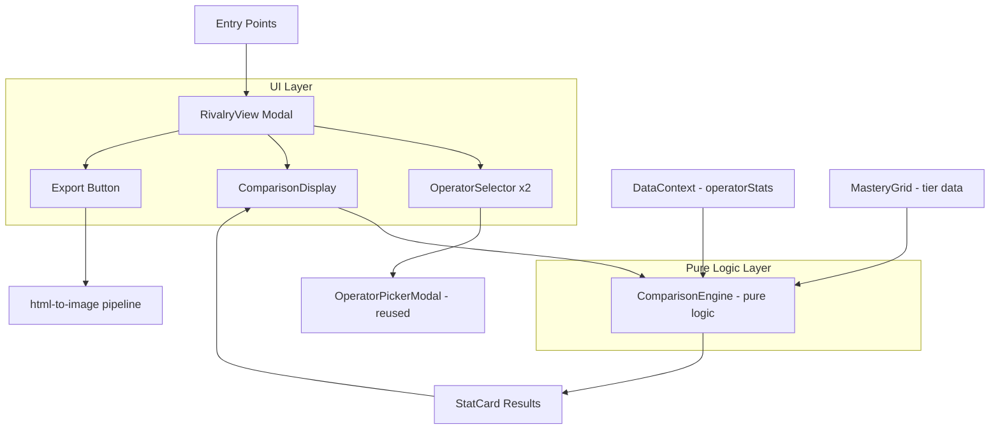
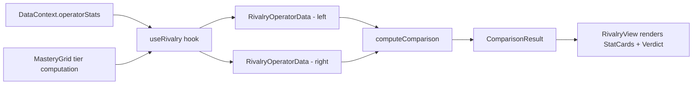

# Design Document: Operator Rivalry

## Overview

The Operator Rivalry feature introduces a head-to-head comparison view where players select two operators and see a side-by-side breakdown of their personal performance stats. It leverages the existing `OperatorStatRecord` data model (kills, deaths, deployments) and the mastery tier system to compute derived metrics (K/D ratio, average kills, pick rate) and present them with clear visual advantage indicators.

The core logic lives in a pure `ComparisonEngine` module that accepts two operator data records and returns structured comparison results. This separation allows comprehensive property-based testing of the comparison logic independently from the UI layer. The UI reuses the existing `OperatorPickerModal` pattern for operator selection and the `html-to-image` (`toPng`) pipeline for image export.

## Architecture



**Key Architectural Decisions:**

1. **Pure comparison engine**: All stat computation and advantage determination lives in `app/lib/comparison-engine.ts` as pure functions with no side effects. This enables thorough property-based testing.
2. **Reuse existing picker**: The `OperatorPickerModal` already supports search and side filtering. The rivalry feature adapts it with a callback pattern rather than rebuilding selection UI.
3. **Modal-based view**: Consistent with existing patterns (`MasteryDetailModal`, `OperatorCardModal`), the rivalry view is a full-screen modal triggered from multiple entry points.
4. **No new data persistence**: All rivalry data is computed on-the-fly from existing `operatorStats` in `DataContext`. No new database tables or local storage keys are needed.

## Components and Interfaces

### ComparisonEngine (`app/lib/comparison-engine.ts`)

The pure logic module responsible for all stat computation and comparison.

```typescript
import type { MasteryTier } from '../components/mastery/MasteryRow';

/** Input data for one side of the comparison */
export interface RivalryOperatorData {
  operatorId: string;
  operatorName: string;
  operatorSide: 'attacker' | 'defender';
  kills: number;
  deaths: number;
  deployments: number;
  tier: MasteryTier;
  totalDeploymentsAllOperators: number; // for pick rate computation
}

/** The advantage determination for a single stat */
export type Advantage = 'left' | 'right' | 'tie';

/** A single stat comparison result */
export interface StatCardResult {
  metric: RivalryMetric;
  label: string;
  leftValue: number | null;   // null = no data
  rightValue: number | null;
  leftDisplay: string;        // formatted for display
  rightDisplay: string;
  advantage: Advantage;
}

/** The set of comparable metrics */
export type RivalryMetric = 
  | 'deployments'
  | 'kills'
  | 'deaths'
  | 'kdRatio'
  | 'avgKills'
  | 'pickRate'
  | 'masteryTier';

/** Summary verdict for the overall comparison */
export interface RivalryVerdict {
  type: 'left-leads' | 'right-leads' | 'even' | 'insufficient-data';
  leftWins: number;
  rightWins: number;
  message: string;
}

/** Full comparison result */
export interface ComparisonResult {
  statCards: StatCardResult[];
  verdict: RivalryVerdict;
}

// Core functions
export function computeComparison(
  left: RivalryOperatorData,
  right: RivalryOperatorData
): ComparisonResult;

export function computeKdRatio(kills: number, deaths: number): number | null;
export function computeAvgKills(kills: number, deployments: number): number | null;
export function computePickRate(operatorDeployments: number, totalDeployments: number): number | null;
export function compareTiers(left: MasteryTier, right: MasteryTier): Advantage;
```

### RivalryView Component (`app/components/rivalry/RivalryView.tsx`)

The main modal component orchestrating the rivalry experience.

```typescript
interface RivalryViewProps {
  isOpen: boolean;
  onClose: () => void;
  prefilledOperator?: Operator | null; // from "Compare" action in MasteryDetailModal
}
```

### RivalrySelector Component (`app/components/rivalry/RivalrySelector.tsx`)

A dual-slot operator selection component.

```typescript
interface RivalrySelectorProps {
  leftOperator: Operator | null;
  rightOperator: Operator | null;
  onSelectLeft: (op: Operator) => void;
  onSelectRight: (op: Operator) => void;
  validationError: string | null;
}
```

### RivalryStatCard Component (`app/components/rivalry/RivalryStatCard.tsx`)

Individual stat row with advantage highlighting.

```typescript
interface RivalryStatCardProps {
  result: StatCardResult;
  leftOperatorName: string;
  rightOperatorName: string;
}
```

### useRivalry Hook (`app/hooks/useRivalry.ts`)

Connects the pure comparison engine to the DataContext.

```typescript
interface UseRivalryReturn {
  leftOperator: Operator | null;
  rightOperator: Operator | null;
  setLeftOperator: (op: Operator | null) => void;
  setRightOperator: (op: Operator | null) => void;
  comparison: ComparisonResult | null;
  validationError: string | null;
  isExporting: boolean;
  exportImage: () => Promise<void>;
}

export function useRivalry(prefilledOperator?: Operator | null): UseRivalryReturn;
```

## Data Models

### Existing Models (no changes required)

| Model | Location | Usage |
|-------|----------|-------|
| `OperatorStatRecord` | `app/types/database.ts` | Source data: kills, deaths, deployments per operator |
| `Operator` | `app/data/types.ts` | Operator identity: id, name, side |
| `MasteryTier` | `app/components/mastery/MasteryRow.tsx` | Tier classification for comparison |

### New Models

| Model | Location | Purpose |
|-------|----------|---------|
| `RivalryOperatorData` | `app/lib/comparison-engine.ts` | Aggregated input for comparison (combines OperatorStatRecord + tier + total deployments) |
| `StatCardResult` | `app/lib/comparison-engine.ts` | Output of a single metric comparison |
| `ComparisonResult` | `app/lib/comparison-engine.ts` | Full comparison output with all stat cards and verdict |
| `RivalryVerdict` | `app/lib/comparison-engine.ts` | Summary tally and message |

### Data Flow



### Mastery Tier Ordering

Tiers are compared using a numeric mapping:

| Tier | Rank |
|------|------|
| unplayed | 0 |
| recruit | 1 |
| operative | 2 |
| veteran | 3 |
| elite | 4 |

### Computation Rules

| Metric | Formula | Null Condition | Better = |
|--------|---------|----------------|----------|
| K/D Ratio | `kills / deaths` (2 decimal places) | kills=0 AND deaths=0 → null; deaths=0 AND kills>0 → kills value | Higher |
| Avg Kills | `kills / deployments` (1 decimal place) | deployments=0 → null | Higher |
| Pick Rate | `(opDeployments / totalDeployments) * 100` (1 decimal place) | deployments=0 → null | Higher |
| Deaths | raw count | never null | **Lower** (fewer deaths = advantage) |
| Deployments | raw count | never null | Higher |
| Kills | raw count | never null | Higher |
| Mastery Tier | tier rank comparison | never null | Higher rank |

## Correctness Properties

*A property is a characteristic or behavior that should hold true across all valid executions of a system—essentially, a formal statement about what the system should do. Properties serve as the bridge between human-readable specifications and machine-verifiable correctness guarantees.*

### Property 1: Same operator validation

*For any* operator, if that operator is placed in both the left and right slots, the system shall produce a validation error and shall not produce a comparison result.

**Validates: Requirements 1.4**

### Property 2: Complete stat card coverage

*For any* two distinct `RivalryOperatorData` records, `computeComparison` shall return exactly 7 `StatCardResult` entries covering all rivalry metrics: deployments, kills, deaths, kdRatio, avgKills, pickRate, and masteryTier.

**Validates: Requirements 2.1**

### Property 3: Advantage determination correctness

*For any* two `RivalryOperatorData` records and any stat card in the comparison result:
- For "higher is better" metrics (kills, deployments, K/D, avg kills, pick rate): if left value > right value then advantage is 'left'; if right > left then 'right'; if equal then 'tie'.
- For "lower is better" metrics (deaths): if left value < right value then advantage is 'left'; if right < left then 'right'; if equal then 'tie'.
- For mastery tier: advantage follows the ordering unplayed < recruit < operative < veteran < elite.

**Validates: Requirements 2.3, 2.4, 2.5, 2.6**

### Property 4: Zero deployments nulls ratio stats

*For any* `RivalryOperatorData` record with `deployments = 0`, the computed average kills and pick rate shall be `null`, and the display string shall show a dash or "No data" rather than a numeric zero.

**Validates: Requirements 2.7**

### Property 5: Verdict count invariant

*For any* comparison result where both operators have at least one deployment, `verdict.leftWins` shall equal the count of stat cards with `advantage === 'left'`, and `verdict.rightWins` shall equal the count of stat cards with `advantage === 'right'`, and `leftWins + rightWins + ties === statCards.length`.

**Validates: Requirements 3.1**

### Property 6: Verdict classification

*For any* comparison result where both operators have at least one deployment: if `leftWins > rightWins` then verdict type is 'left-leads'; if `rightWins > leftWins` then verdict type is 'right-leads'; if `leftWins === rightWins` then verdict type is 'even'.

**Validates: Requirements 3.2, 3.3**

### Property 7: Insufficient data verdict

*For any* pair of `RivalryOperatorData` records where at least one has `deployments = 0`, the verdict type shall be 'insufficient-data' and the verdict shall not report advantage counts.

**Validates: Requirements 3.4**

### Property 8: K/D ratio computation

*For any* non-negative integers `kills` and `deaths`:
- If `deaths > 0`: `computeKdRatio(kills, deaths)` equals `Math.round((kills / deaths) * 100) / 100`
- If `deaths === 0` and `kills === 0`: result is `null`
- If `deaths === 0` and `kills > 0`: result equals `kills` (perfect K/D)

**Validates: Requirements 7.2, 7.3**

### Property 9: Average kills computation

*For any* non-negative integers `kills` and `deployments`:
- If `deployments > 0`: `computeAvgKills(kills, deployments)` equals `Math.round((kills / deployments) * 10) / 10`
- If `deployments === 0`: result is `null`

**Validates: Requirements 7.4**

### Property 10: Pick rate computation

*For any* non-negative integer `operatorDeployments` and positive integer `totalDeployments` where `operatorDeployments <= totalDeployments`:
- `computePickRate(operatorDeployments, totalDeployments)` equals `Math.round((operatorDeployments / totalDeployments) * 1000) / 10`

**Validates: Requirements 7.5**

### Property 11: Comparison symmetry

*For any* two `RivalryOperatorData` records A and B, computing `computeComparison(A, B)` and `computeComparison(B, A)` shall produce mirrored results: for each stat card at index `i`, if the first comparison shows advantage 'left' then the swapped comparison shows 'right' at the same index, and vice versa; ties remain ties; and absolute numeric values are identical.

**Validates: Requirements 7.6**

### Property 12: Well-formed output structure

*For any* two valid `RivalryOperatorData` records, every `StatCardResult` in the output shall have a non-empty `metric` string matching one of the defined `RivalryMetric` values, non-empty `label` and display strings, and an `advantage` value that is exactly 'left', 'right', or 'tie'.

**Validates: Requirements 7.1**

### Property 13: ARIA labels on stat cards

*For any* `StatCardResult` rendered as a `RivalryStatCard` component, the output DOM shall contain an `aria-label` attribute that includes the metric name, both operator values, and which operator has the advantage (or "tie").

**Validates: Requirements 6.2**

### Property 14: Advantage indicator accessibility

*For any* `StatCardResult` with advantage not equal to 'tie', the rendered advantage indicator shall include both a CSS color class and a supplementary text indicator (arrow or "leads" label) so that the advantage is perceivable without color vision.

**Validates: Requirements 6.4**

## Error Handling

| Scenario | Handling |
|----------|----------|
| Same operator selected for both slots | Display inline validation message, suppress comparison computation |
| Operator has zero deployments | Display "No data" / dash for ratio stats; verdict shows "Not enough data" |
| Division by zero in K/D (0 kills, 0 deaths) | Return `null`, display dash |
| Division by zero in pick rate (0 total deployments) | Return `null`, display dash |
| Image export failure (toPng throws) | Catch error, show non-blocking toast, keep comparison visible |
| Navigator.share unavailable | Fallback to download link via anchor element click |
| Operator data not found in stats map | Treat as zero-deployment operator (0 kills, 0 deaths, 0 deployments, tier='unplayed') |

## Testing Strategy

### Property-Based Tests (fast-check + vitest)

The `ComparisonEngine` is a pure function module ideal for property-based testing. All properties above (1–12) will be implemented as property-based tests using `fast-check` (already in devDependencies) with minimum 100 iterations each.

**Test file**: `app/lib/__tests__/comparison-engine.property.test.ts`

**Generators needed:**
- `arbitraryRivalryOperatorData`: Generates valid `RivalryOperatorData` with random operator ids, kills (0–9999), deaths (0–9999), deployments (0–999), random tiers, and totalDeploymentsAllOperators >= operatorDeployments
- `arbitraryMasteryTier`: Picks uniformly from the 5 tier values
- `arbitraryNonNegativeInt`: Non-negative integers for kills/deaths/deployments
- `arbitraryPositiveInt`: Positive integers for total deployments (avoiding division by zero)

**Configuration:**
- Minimum 100 iterations per property
- Each test tagged with: `Feature: operator-rivalry, Property {N}: {title}`

**Property test library:** `fast-check` v4.8.0 (already installed)

### Unit Tests (example-based)

**Test file**: `app/lib/__tests__/comparison-engine.test.ts`

Cover specific examples and edge cases:
- Concrete comparison between two known operators with known stats
- K/D edge cases: 0/0, 5/0, 0/5
- Tie scenario where all stats are equal
- One elite vs one unplayed operator

### Component Tests

**Test file**: `app/components/rivalry/__tests__/RivalryView.test.tsx`

- Initial render with empty slots
- Operator selection flow
- Same operator validation message
- Export button visibility
- Export error handling (mocked toPng failure)
- Keyboard navigation (Tab, Escape)
- Focus trap behavior
- Pre-filled operator from MasteryDetailModal
- ARIA labels and accessibility attributes

### Integration Considerations

- No new API endpoints or database interactions
- All data comes from existing `DataContext.operatorStats`
- Image export uses existing `html-to-image` library pattern
- No network calls needed for the comparison feature itself

