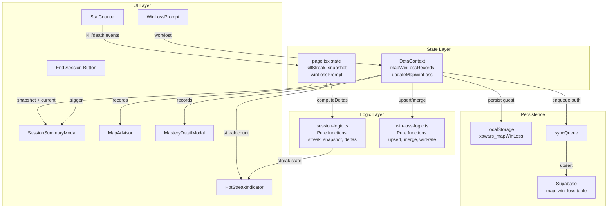

# Design Document: Session Enhancements

## Overview

Session Enhancements adds three motivational features to XAWARS RNG: a hot streak indicator for real-time feedback during killing sprees, a session summary modal for end-of-session performance review, and map win/loss tracking for long-term map outcome analysis.

The design follows the same architectural patterns as the existing map-performance-tracking feature:
- **Pure logic modules** for data transformations and computations
- **DataContext** for state and persistence orchestration
- **syncQueue** for offline-resilient Supabase sync
- **usePersistedState** for localStorage-backed state (guests)
- **In-memory state** for ephemeral session data (streak counter, snapshot)

### Key Design Decisions

1. **Streak counter is in-memory only** — The kill streak counter resets on page load. This keeps it session-scoped without polluting localStorage, and avoids stale streak data confusing users returning after time away.
2. **Session snapshot captures at hydration** — The snapshot records state after localStorage/Supabase hydration completes, ensuring deltas are computed against the true session-start values rather than default zeros.
3. **Win/loss recording is post-confirmation, not post-map-selection** — The "Won"/"Lost" prompt appears after the user confirms a kill/death increment through the MapPickerModal, since that's the natural point where a match has concluded.
4. **Win/loss data stored separately from MapPerformanceRecord** — A new `MapWinLossRecord` type keeps win/loss counts independent from the kills/deaths/matches tracking. This avoids coupling match outcomes to individual kill increments and allows recording win/loss even without a kill or death (e.g., recording outcome for a match where the user didn't track kills).
5. **Win rate computation is a pure function** — All display logic (rate calculation, threshold gating, limited data labeling) lives in a pure module, making it trivial to property-test.

## Architecture



### Data Flow

1. **Streak Tracking**: Kill increment → `updateStreak('kill')` → counter +1 → derive `isHotStreak` (counter ≥ 3). Death increment → `updateStreak('death')` → counter = 0 → `isHotStreak` = false.
2. **Session Snapshot**: Page load → hydration completes → `captureSnapshot(currentState)` stores kills, deaths, operator stats, win/loss records in memory ref. End session → compute deltas → show modal → on close, re-capture snapshot.
3. **Win/Loss Recording**: MapPickerModal confirms → page state stores `lastConfirmedMapId` → WinLossPrompt shows → user taps Won/Lost → `DataContext.updateMapWinLoss(mapId, outcome)` → upsert record → persist.
4. **Win Rate Display**: MapAdvisor/MasteryDetailModal reads `mapWinLossRecords` from DataContext → `computeWinRate(record)` → render percentage with threshold labels.

## Components and Interfaces

### New Components

#### `HotStreakIndicator` (`app/components/HotStreakIndicator.tsx`)
A purely decorative component displaying a flame icon and streak count when the user has 3+ consecutive kills.

```typescript
interface HotStreakIndicatorProps {
  streakCount: number;
  isActive: boolean;
}
```

Renders adjacent to the kill StatCounter. Uses CSS transitions for entry/exit animations (300ms in, 200ms out). Includes `aria-label` with dynamic streak count for screen readers.

#### `SessionSummaryModal` (`app/components/SessionSummaryModal.tsx`)
A modal displaying session performance deltas when the user ends their session.

```typescript
interface SessionSummaryModalProps {
  isOpen: boolean;
  onClose: () => void;
  sessionData: SessionDeltaData;
}

interface SessionDeltaData {
  kills: number;
  deaths: number;
  kdRatio: number | null; // null when deaths = 0 and kills = 0
  isPerfect: boolean;     // true when kills > 0 and deaths = 0
  isEmpty: boolean;       // true when kills = 0 and deaths = 0
  operators: SessionOperatorDelta[];
  bestMap: SessionBestMap | null;
}

interface SessionOperatorDelta {
  operatorId: string;
  operatorName: string;
  kills: number;
  deaths: number;
}

interface SessionBestMap {
  mapId: string;
  mapName: string;
  kd: number;
}
```

#### `WinLossPrompt` (`app/components/WinLossPrompt.tsx`)
A compact prompt with "Won" and "Lost" buttons shown after a kill/death increment is confirmed with a map selected.

```typescript
interface WinLossPromptProps {
  mapId: string;
  mapName: string;
  onWin: () => void;
  onLoss: () => void;
  onDismiss: () => void;
}
```

### Modified Components

- **`page.tsx`**: Add in-memory state for `killStreak`, `sessionSnapshot`, `winLossPromptMapId`. Add "End Session" button in options area. Render `HotStreakIndicator` and `WinLossPrompt`.
- **`MapAdvisor`**: Add win rate display in map performance sections using `mapWinLossRecords` from DataContext.
- **`MasteryDetailModal` / `MapBreakdownPanel`**: Add win rate column when win/loss data exists for the operator's maps.
- **`DataContext`**: Add `mapWinLossRecords` state, `updateMapWinLoss()` action, hydration from Supabase for authenticated users.

### New Library Modules

#### `session-logic.ts` (`app/lib/session-logic.ts`)
Pure functions for streak computation and session delta calculation.

```typescript
// Streak state machine
export interface StreakState {
  count: number;
  isHotStreak: boolean;
}

export function initialStreakState(): StreakState;
export function applyStreakAction(state: StreakState, action: 'kill' | 'death' | 'decrement'): StreakState;

// Session snapshot
export interface SessionSnapshot {
  totalKills: number;
  totalDeaths: number;
  operatorStats: Record<string, { kills: number; deaths: number }>;
  mapWinLoss: Record<string, { wins: number; losses: number }>;
}

export function captureSnapshot(
  totalKills: number,
  totalDeaths: number,
  operatorKills: Record<string, number>,
  operatorDeaths: Record<string, number>,
  mapWinLoss: Record<string, MapWinLossRecord>
): SessionSnapshot;

export function computeSessionDeltas(
  snapshot: SessionSnapshot,
  currentKills: number,
  currentDeaths: number,
  currentOperatorKills: Record<string, number>,
  currentOperatorDeaths: Record<string, number>,
  currentMapWinLoss: Record<string, MapWinLossRecord>,
  operatorNames: Record<string, string>
): SessionDeltaData;

export function findBestSessionMap(
  snapshotMapWinLoss: Record<string, { wins: number; losses: number }>,
  currentMapPerformance: Record<string, MapPerformanceRecord>,
  snapshotMapPerformance: Record<string, MapPerformanceRecord>,
  mapNames: Record<string, string>
): SessionBestMap | null;
```

#### `win-loss-logic.ts` (`app/lib/win-loss-logic.ts`)
Pure functions for win/loss data transformations.

```typescript
export interface MapWinLossRecord {
  mapId: string;
  wins: number;
  losses: number;
}

// Core upsert: increment wins or losses for a map
export function upsertMapWinLoss(
  records: Record<string, MapWinLossRecord>,
  mapId: string,
  outcome: 'win' | 'loss'
): Record<string, MapWinLossRecord>;

// Compute win rate percentage (rounded to nearest whole number)
export function computeWinRate(record: MapWinLossRecord): number | null;
// Returns null when wins + losses === 0

// Check if record has limited data (< 5 outcomes)
export function hasLimitedData(record: MapWinLossRecord): boolean;

// Get total outcomes for a record
export function getTotalOutcomes(record: MapWinLossRecord): number;

// Merge local and cloud win/loss records (additive)
export function mergeMapWinLossRecords(
  local: Record<string, MapWinLossRecord>,
  cloud: Record<string, MapWinLossRecord>
): Record<string, MapWinLossRecord>;

// Serialize/deserialize for localStorage
export function serializeMapWinLoss(records: Record<string, MapWinLossRecord>): string;
export function deserializeMapWinLoss(json: string): Record<string, MapWinLossRecord>;
```

## Data Models

### `MapWinLossRecord` (new type in `app/types/database.ts`)

```typescript
export interface MapWinLossRecord {
  mapId: string;
  wins: number;
  losses: number;
}
```

### `StreakState` (in-memory only, not persisted)

```typescript
interface StreakState {
  count: number;        // 0..N consecutive kills
  isHotStreak: boolean; // count >= 3
}
```

### `SessionSnapshot` (in-memory only, not persisted)

```typescript
interface SessionSnapshot {
  totalKills: number;
  totalDeaths: number;
  operatorStats: Record<string, { kills: number; deaths: number }>;
  mapWinLoss: Record<string, { wins: number; losses: number }>;
}
```

### `SessionDeltaData` (computed for display)

```typescript
interface SessionDeltaData {
  kills: number;
  deaths: number;
  kdRatio: number | null;
  isPerfect: boolean;
  isEmpty: boolean;
  operators: SessionOperatorDelta[];
  bestMap: SessionBestMap | null;
}

interface SessionOperatorDelta {
  operatorId: string;
  operatorName: string;
  kills: number;
  deaths: number;
}

interface SessionBestMap {
  mapId: string;
  mapName: string;
  kd: number;
}
```

### localStorage Schema

Key: `xawars_mapWinLoss`

```json
{
  "bank": { "mapId": "bank", "wins": 5, "losses": 3 },
  "border": { "mapId": "border", "wins": 2, "losses": 4 }
}
```

Keyed by `mapId` (not composite like map performance — win/loss is per-map regardless of operator).

### Supabase Table: `map_win_loss`

| Column | Type | Constraints |
|--------|------|-------------|
| id | uuid | PRIMARY KEY, DEFAULT gen_random_uuid() |
| user_id | uuid | NOT NULL, REFERENCES auth.users(id) |
| map_id | text | NOT NULL |
| wins | integer | NOT NULL, DEFAULT 0 |
| losses | integer | NOT NULL, DEFAULT 0 |
| updated_at | timestamptz | NOT NULL, DEFAULT now() |

**Unique constraint**: `(user_id, map_id)`

**Upsert SQL pattern**:
```sql
INSERT INTO map_win_loss (user_id, map_id, wins, losses, updated_at)
VALUES ($1, $2, $3, $4, now())
ON CONFLICT (user_id, map_id)
DO UPDATE SET
  wins = map_win_loss.wins + EXCLUDED.wins,
  losses = map_win_loss.losses + EXCLUDED.losses,
  updated_at = now();
```

## Correctness Properties

*A property is a characteristic or behavior that should hold true across all valid executions of a system — essentially, a formal statement about what the system should do. Properties serve as the bridge between human-readable specifications and machine-verifiable correctness guarantees.*

### Property 1: Streak counter state machine

*For any* sequence of actions (kill, death, decrement) applied to an initial streak state of 0, the resulting counter SHALL equal the number of consecutive kills since the last death (or start), minus any decrements applied since the last death, with a floor of 0.

**Validates: Requirements 1.2, 1.3, 1.7**

### Property 2: Hot streak state derivation

*For any* streak counter value, the `isHotStreak` state SHALL be `true` if and only if the counter is ≥ 3.

**Validates: Requirements 1.4, 1.5**

### Property 3: Indicator display correctness

*For any* active hot streak with counter value N (where N ≥ 3), the HotStreakIndicator SHALL display the value N both visually and in the `aria-label` attribute.

**Validates: Requirements 2.2, 2.7**

### Property 4: Session snapshot captures current state

*For any* valid combination of total kills, total deaths, operator kill/death counts, and map win/loss records, `captureSnapshot()` SHALL produce a SessionSnapshot where each field equals the corresponding input value.

**Validates: Requirements 3.1, 3.6**

### Property 5: Session delta computation

*For any* SessionSnapshot and current state values, `computeSessionDeltas()` SHALL produce kills = (currentKills - snapshotKills), deaths = (currentDeaths - snapshotDeaths), and per-operator deltas computed analogously, with operators sorted by session kills descending then name ascending.

**Validates: Requirements 4.2**

### Property 6: Session best map selection

*For any* set of map performance deltas during a session where at least one map has kills or deaths recorded, `findBestSessionMap()` SHALL return the map with the highest session K/D ratio; when multiple maps tie on K/D, it SHALL return the map with higher total session kills.

**Validates: Requirements 4.5**

### Property 7: Win/loss upsert correctness

*For any* existing Map_Win_Loss_Records and any map ID with outcome "win" or "loss", `upsertMapWinLoss()` SHALL increment exactly the wins or losses field (respectively) of the specified map by 1, leaving all other maps' records unchanged.

**Validates: Requirements 6.3, 6.4**

### Property 8: Win/loss dismiss preserves state

*For any* Map_Win_Loss_Records state, dismissing the Win/Loss prompt (not calling upsert) SHALL leave the records identical to the pre-prompt state.

**Validates: Requirements 6.5**

### Property 9: Win/loss localStorage round-trip

*For any* valid set of MapWinLossRecords, `serializeMapWinLoss()` followed by `deserializeMapWinLoss()` SHALL produce an equivalent set of records.

**Validates: Requirements 7.1**

### Property 10: Win/loss migration merge

*For any* two sets of MapWinLossRecords (local and cloud), `mergeMapWinLossRecords()` SHALL produce records where each map's wins equal `local.wins + cloud.wins` and losses equal `local.losses + cloud.losses`. Non-overlapping maps SHALL be included unchanged.

**Validates: Requirements 7.4**

### Property 11: Failed persistence preserves state

*For any* MapWinLossRecords state and any failed persistence operation, the state after the operation SHALL be identical to the state before.

**Validates: Requirements 7.5**

### Property 12: Win rate computation

*For any* MapWinLossRecord with (wins + losses) > 0, `computeWinRate()` SHALL return `Math.round(wins / (wins + losses) * 100)`. For records with (wins + losses) = 0, it SHALL return null.

**Validates: Requirements 8.1, 8.2, 8.3**

### Property 13: Limited data threshold

*For any* MapWinLossRecord, `hasLimitedData()` SHALL return `true` if and only if (wins + losses) < 5.

**Validates: Requirements 8.5**

## Error Handling

| Scenario | Handling Strategy |
|----------|-------------------|
| localStorage full (quota exceeded) on win/loss write | Catch `QuotaExceededError`, log warning, continue. In-memory state remains correct; next successful write persists all data. |
| localStorage corrupted (invalid JSON for `xawars_mapWinLoss`) | `deserializeMapWinLoss` returns empty `{}`. System starts fresh. Supabase remains authoritative for authenticated users. |
| Supabase upsert fails for win/loss (network error) | `syncQueue` retains operation with retry (max 3). Local state already updated optimistically. |
| Supabase upsert conflict on `map_win_loss` | Additive SQL pattern means conflicts are resolved by summing. Existing `syncQueue` conflict resolution handles edge cases. |
| Migration merge fails mid-operation | Per-record transactional. Successfully merged records persist; failures remain in localStorage for next attempt. |
| Session snapshot capture during hydration race | `useRef` flag prevents double-capture. If hydration never completes (error), snapshot uses zero defaults. |
| Division by zero in win rate (0 wins + 0 losses) | `computeWinRate` returns `null`. UI renders nothing for that map. |
| Division by zero in session K/D (0 deaths) | When kills > 0 and deaths = 0, display "Perfect". When both 0, display empty session message. |
| Kill decrement below 0 streak | `applyStreakAction` floors at 0. No negative streak values possible. |
| HotStreakIndicator animation interruption | CSS transition uses `will-change` and checks animation state via ref. Re-entry during exit cancels exit and starts entry from current transform values. |

## Testing Strategy

### Property-Based Tests (fast-check, minimum 100 iterations each)

The following property-based tests target the pure logic in `app/lib/session-logic.ts` and `app/lib/win-loss-logic.ts`:

| Property | Test File | What's Generated |
|----------|-----------|-----------------|
| P1: Streak counter state machine | `session-logic.property.test.ts` | Random sequences of 'kill' \| 'death' \| 'decrement' actions |
| P2: Hot streak state derivation | `session-logic.property.test.ts` | Random counter values (0–100) |
| P3: Indicator display correctness | `session-logic.property.test.ts` | Random counter values ≥ 3 |
| P4: Snapshot captures current state | `session-logic.property.test.ts` | Random kills, deaths, operator stats, win/loss records |
| P5: Session delta computation | `session-logic.property.test.ts` | Random snapshot + current state pairs (current ≥ snapshot) |
| P6: Session best map selection | `session-logic.property.test.ts` | Random map performance delta sets |
| P7: Win/loss upsert correctness | `win-loss-logic.property.test.ts` | Random existing records + random mapId + random outcome |
| P8: Win/loss dismiss preserves state | `win-loss-logic.property.test.ts` | Random record states |
| P9: Win/loss localStorage round-trip | `win-loss-logic.property.test.ts` | Random MapWinLossRecord sets |
| P10: Migration merge | `win-loss-logic.property.test.ts` | Two random record sets with overlapping/disjoint maps |
| P11: Failed persistence preserves state | `win-loss-logic.property.test.ts` | Random state + simulated failure |
| P12: Win rate computation | `win-loss-logic.property.test.ts` | Random wins/losses pairs (0–1000) |
| P13: Limited data threshold | `win-loss-logic.property.test.ts` | Random wins/losses pairs |

**Library**: `fast-check` (already in devDependencies)
**Runner**: `vitest --run`
**Tag format**: `Feature: session-enhancements, Property {N}: {title}`

### Unit Tests (example-based)

| Test | Validates |
|------|-----------|
| Streak counter initializes to 0 | Req 1.1 |
| Streak counter not persisted to localStorage | Req 1.6 |
| HotStreakIndicator renders flame icon when active | Req 2.1 |
| HotStreakIndicator entry animation classes applied | Req 2.3 |
| HotStreakIndicator exit animation classes applied | Req 2.4 |
| HotStreakIndicator has no side effects on data | Req 2.6 |
| Snapshot defers until hydration completes | Req 3.3 |
| Snapshot uses zero defaults on hydration failure | Req 3.4 |
| Snapshot not overwritten on visibility change | Req 3.5 |
| End Session button shows modal | Req 4.1 |
| Session summary shows "Perfect" when deaths = 0 | Req 4.3 |
| Session summary shows empty message when both 0 | Req 4.4 |
| Close button dismisses and resets snapshot | Req 4.6 |
| No modal shown on beforeunload | Req 4.7 |
| End Session button visible when deployed | Req 5.1 |
| End Session button hidden when no operator | Req 5.2 |
| End Session button styling is subdued | Req 5.3 |
| End Session button keyboard accessible | Req 5.4 |
| End Session button minimum tap target | Req 5.5 |
| Won/Lost buttons appear after map confirm | Req 6.1 |
| Won/Lost buttons persist until action | Req 6.2 |
| Won/Lost buttons use correct colors | Req 6.6 |
| Win rate displayed alongside map metrics | Req 8.4 |

### Integration Tests

| Test | Validates |
|------|-----------|
| syncQueue enqueues correct payload for win/loss | Req 7.2 |
| Offline win/loss enqueues and drains on reconnect | Req 7.3 |
| Guest→auth migration merges win/loss to cloud | Req 7.4 |

### Edge Case Tests

| Test | Validates |
|------|-----------|
| Animation interruption on rapid streak toggle | Req 2.5 |
| Snapshot capture during slow hydration | Req 3.3 |
| Kill decrement at streak 0 stays at 0 | Req 1.7 edge |
